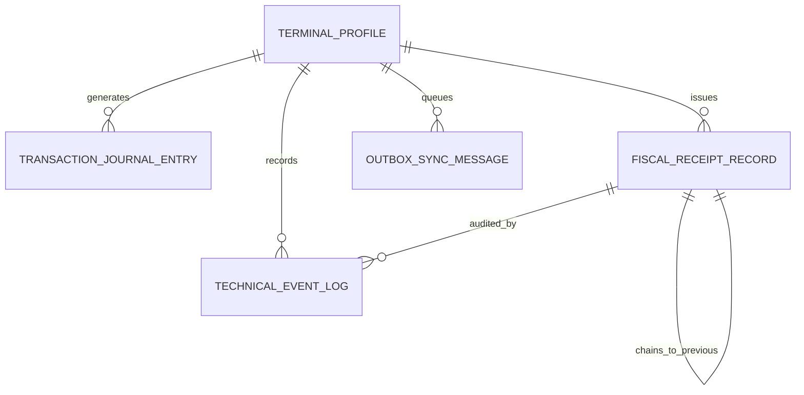

# Data Model: Phase 0 - Architectural Framing & Technical Standards

**Feature**: `001-phase0-architecture-standards`
**Date**: 2026-08-15
**Status**: Complete

## 1. Domain Value Objects

### Money
Represents a monetary value with zero floating-point rounding errors.

| Field | Type | Constraints | Description |
| :--- | :--- | :--- | :--- |
| `AmountInCents` | `long` | $\ge 0$ (or signed for refunds) | Amount represented in integer currency sub-units (e.g., Euro cents) |
| `Currency` | `string` | Exactly 3 uppercase chars (e.g., `EUR`, `USD`) | ISO 4217 currency code |

### TaxBreakdownItem
Represents the tax breakdown for a specific tax category.

| Field | Type | Constraints | Description |
| :--- | :--- | :--- | :--- |
| `TaxRatePercent` | `decimal` | Precision (5,2), e.g., `5.50`, `10.00`, `20.00` | Applied tax percentage |
| `TaxableBaseCents` | `long` | $\ge 0$ | Total net taxable amount in cents (HT) |
| `TaxAmountCents` | `long` | $\ge 0$ | Calculated tax amount in cents |

---

## 2. Core Entities & Persistence Models

### TransactionJournalEntry (Local-First Append-Only Journal)
Immutable local ledger entry recorded prior to external dispatch.

| Field | Type | Constraints | Description |
| :--- | :--- | :--- | :--- |
| `Id` | `Guid` (UUIDv7) | Primary Key, Non-null | Chronologically sortable unique identifier |
| `LocalSequence` | `long` | Monotonic auto-increment per device | Local sequence index in terminal SQLite journal |
| `TerminalId` | `string` | Max 32 chars, Non-null | Unique identifier of the originating POS device |
| `OccurredAtUtc` | `DateTimeOffset` | UTC, Non-null | Timestamp of transaction creation |
| `IdempotencyKey` | `string` | Max 64 chars, Indexed | Unique deduplication key |
| `EventType` | `string` | Max 64 chars | Event name (e.g., `OrderCreated`, `PaymentCompleted`) |
| `PayloadJson` | `string` | Valid JSON | Full serialized event payload |
| `EntryHash` | `string` | 64 hex chars (SHA-256) | SHA-256 checksum of the journal entry |

---

### FiscalReceiptRecord (NF525 Cryptographic Ledger)
Represents a finalized customer sale and receipt subject to fiscal audit.

| Field | Type | Constraints | Description |
| :--- | :--- | :--- | :--- |
| `Id` | `Guid` (UUIDv7) | Primary Key, Non-null | Unique fiscal receipt ID |
| `TerminalPrefix` | `string` | Max 10 chars (e.g., `POS01`) | Device prefix to isolate numbering series |
| `SequentialNumber` | `long` | Monotonic per terminal | Unbroken serial number (e.g., `1042` $\to$ `POS01-001042`) |
| `ClosedAtUtc` | `DateTimeOffset` | UTC, Non-null | Exact time receipt was finalized |
| `TotalTtcCents` | `long` | Non-null | Grand total including taxes in cents |
| `TotalHtCents` | `long` | Non-null | Total excluding taxes in cents |
| `TaxBreakdownJson` | `string` | Valid JSON | Detailed list of `TaxBreakdownItem` |
| `PreviousHash` | `string` | 64 hex chars (SHA-256) | Hash of the preceding receipt in the chain ($Hash_{n-1}$) |
| `CurrentHash` | `string` | 64 hex chars (SHA-256) | Current chained signature: $\text{SHA256}(PreviousHash + ClosedAtUtc + TotalTtc + TaxBreakdown)$ |
| `OperatorId` | `Guid` | Foreign Key | Operator who closed the receipt |
| `IsArchived` | `bool` | Default `false` | True when included in an immutable Z-closure |

---

### TechnicalEventLogEntry (JET - Journal des Événements Techniques)
Captures operational system actions for fiscal auditability.

| Field | Type | Constraints | Description |
| :--- | :--- | :--- | :--- |
| `Id` | `Guid` (UUIDv7) | Primary Key, Non-null | Unique event identifier |
| `TimestampUtc` | `DateTimeOffset` | UTC, Non-null | Timestamp of event |
| `TerminalId` | `string` | Max 32 chars | Identifier of originating device |
| `OperatorId` | `Guid` | Foreign Key | Staff member who triggered the action |
| `ActionType` | `string` | Enum (e.g., `DrawerOpen`, `ItemVoid`, `TicketReprint`, `ManualPriceOverride`) | Specific operational action |
| `ReasonCode` | `string` | Max 128 chars | Mandatory reason explanation for audit |
| `ContextDataJson` | `string` | Valid JSON | State snapshot or related receipt reference |

---

### OutboxSyncMessage (Resilient Sync Queue)
Tracks offline events buffered locally awaiting transmission to the central backend.

| Field | Type | Constraints | Description |
| :--- | :--- | :--- | :--- |
| `Id` | `Guid` (UUIDv7) | Primary Key | Message identifier |
| `TerminalId` | `string` | Max 32 chars | Originating terminal ID |
| `CreatedAtUtc` | `DateTimeOffset` | UTC | Creation timestamp |
| `Status` | `int` | Enum (`Pending = 0`, `InFlight = 1`, `Completed = 2`, `Failed = 3`) | Synchronization status |
| `RetryCount` | `int` | Default `0` | Number of dispatch attempts |
| `LastAttemptUtc` | `DateTimeOffset?` | Nullable UTC | Timestamp of latest retry |
| `PayloadJson` | `string` | Non-null JSON | Payload to dispatch |
| `ErrorMessage` | `string?` | Nullable | Error details if failed |

---

### TerminalProfile
Represents the configuration of a physical POS station.

| Field | Type | Constraints | Description |
| :--- | :--- | :--- | :--- |
| `TerminalId` | `string` | Primary Key, Max 32 chars | Unique station code (e.g., `TERM-BAR-01`) |
| `Prefix` | `string` | Max 10 chars (e.g., `POS01`) | Prefix for fiscal sequential numbering |
| `StationRole` | `int` | Enum (`CounterPOS = 0`, `WaiterHandheld = 1`, `KitchenKDS = 2`) | Role profile of terminal |
| `AssignedPrinterIp` | `string?` | IPv4 / Hostname | Direct ESC/POS network printer target |
| `IsActive` | `bool` | Default `true` | Operational status |

---

## 3. Entity Relationships Diagram

