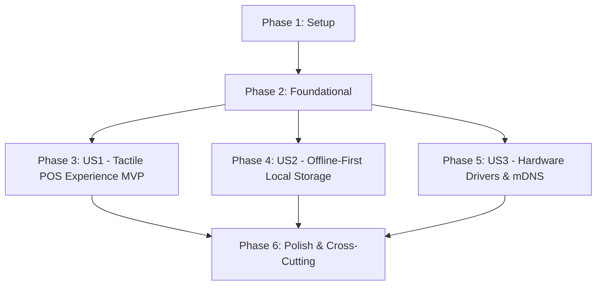

# Implementation Tasks: Cross-Platform Tactile Frontend (iOS, Android & Windows)

**Feature**: `002-cross-platform-frontend`
**Specification**: [specs/002-cross-platform-frontend/spec.md](spec.md)
**Implementation Plan**: [specs/002-cross-platform-frontend/plan.md](plan.md)
**Status**: Completed

---

## Phase 1: Setup (Multi-Target Project & Solution Infrastructure)

**Purpose**: Initialize multi-targeted .NET MAUI project structure, solution properties, and platform manifest declarations.

- [X] T001 Initialize multi-target .NET MAUI project file `src/RestaurantPos.Client.Maui/RestaurantPos.Client.Maui.csproj` targeting `net9.0-ios`, `net9.0-android`, and `net9.0-windows10.0.19041.0` with `TreatWarningsAsErrors=true`
- [X] T002 [P] Configure solution root `Directory.Build.props` and `.editorconfig` with strict Roslyn analyzer rules, nullable reference types, and C# 13 formatting
- [X] T003 [P] Configure `src/RestaurantPos.Client.Maui/MauiProgram.cs` with dependency injection container, CommunityToolkit.Mvvm source generators, and platform service registrations
- [X] T004 [P] Configure iOS permissions and orientations in `src/RestaurantPos.Client.Maui/Platforms/iOS/Info.plist` (`NSLocalNetworkUsageDescription`, `NSBonjourServices`)
- [X] T005 [P] Configure Android permissions and touchscreen hardware features in `src/RestaurantPos.Client.Maui/Platforms/Android/AndroidManifest.xml` (`CHANGE_WIFI_MULTICAST_STATE`, `NEARBY_WIFI_DEVICES`, `INTERNET`)
- [X] T006 [P] Configure Windows capability declarations in `src/RestaurantPos.Client.Maui/Platforms/Windows/Package.appxmanifest` (`privateNetworkClientServer`)

---

## Phase 2: Foundational (Core Abstractions & Platform Storage Infrastructure)

**Purpose**: Core infrastructure and platform-agnostic storage services that MUST be complete before ANY user story UI can be integrated.

- [X] T007 [P] Define `DevicePlatformProfile`, `ScreenClassType`, and `PlatformType` domain models in `src/RestaurantPos.Client.Maui/Models/DevicePlatformProfile.cs`
- [X] T008 [P] Define `IPlatformEnvironmentService` and `HapticFeedbackType` contracts in `src/RestaurantPos.Client.Maui/Contracts/IPlatformEnvironmentService.cs`
- [X] T009 Implement cross-platform sandboxed path resolver and environment services in `src/RestaurantPos.Client.Maui/Services/PlatformEnvironmentService.cs` using `FileSystem.AppDataDirectory`
- [X] T010 [P] Setup base test project `tests/RestaurantPos.Client.Maui.Tests/RestaurantPos.Client.Maui.Tests.csproj` with xUnit, FluentAssertions, and platform mock runners
- [X] T011 Implement unit tests for sandboxed storage resolution and device profile detection in `tests/RestaurantPos.Client.Maui.Tests/PlatformEnvironmentServiceTests.cs`

**Checkpoint**: Core platform abstractions and sandboxed storage validated across iOS, Android, and Windows.

---

## Phase 3: User Story 1 - Unified Cross-Platform Tactile POS Experience (Priority: P1) 🎯 MVP

**Goal**: Deliver a responsive, touch-first POS interface with custom on-screen numeric keypad, large touch targets, and adaptive multi-breakpoint layouts across iOS, Android, and Windows.

### Tests for User Story 1

- [X] T012 [P] [US1] Create component unit tests for responsive breakpoint layout transitions in `tests/RestaurantPos.Client.Maui.Tests/ResponsiveGridContainerTests.cs`
- [X] T013 [P] [US1] Create component unit tests for custom numeric keypad input events in `tests/RestaurantPos.Client.Maui.Tests/NumericKeypadViewModelTests.cs`

### Implementation for User Story 1

- [X] T014 [P] [US1] Implement custom on-screen numeric keypad control `src/RestaurantPos.Client.Maui/Controls/NumericKeypadView.xaml` and code-behind `src/RestaurantPos.Client.Maui/Controls/NumericKeypadView.xaml.cs`
- [X] T015 [P] [US1] Implement tactile product tile button control with haptic tap feedback in `src/RestaurantPos.Client.Maui/Controls/ProductTileButton.xaml` and `src/RestaurantPos.Client.Maui/Controls/ProductTileButton.xaml.cs`
- [X] T016 [US1] Implement adaptive responsive grid container in `src/RestaurantPos.Client.Maui/Controls/ResponsiveGridContainer.cs` for Handheld (<700dp), Tablet (700-1100dp), and Counter AIO (>1100dp)
- [X] T017 [P] [US1] Implement shared design styles, color tokens (Light & Dark themes), and touch target metrics ($\ge 54\times 54\text{ pt}$) in `src/RestaurantPos.Client.Maui/Resources/Styles/Styles.xaml`
- [X] T018 [US1] Implement MVVM ViewModel for order entry and basket calculations in `src/RestaurantPos.Client.Maui/ViewModels/PosTerminalViewModel.cs` using `CommunityToolkit.Mvvm`
- [X] T019 [US1] Implement tactile sales view in `src/RestaurantPos.Client.Maui/Views/PosTerminalPage.xaml` and `src/RestaurantPos.Client.Maui/Views/PosTerminalPage.xaml.cs` with dynamic catalog grid, active cart, and integrated numpad
- [X] T020 [US1] Implement operator PIN authentication view in `src/RestaurantPos.Client.Maui/Views/PinLockPage.xaml` and `src/RestaurantPos.Client.Maui/ViewModels/PinLockViewModel.cs` with manual session lock

**Checkpoint**: User Story 1 is fully functional and testable independently across iOS, Android, and Windows (MVP Ready).

---

## Phase 4: User Story 2 - Platform-Agnostic Local-First Persistence & Offline Synchronization (Priority: P1)

**Goal**: Enable 100% offline sales operations with local append-only journaling and background Outbox synchronization across all platforms.

### Tests for User Story 2

- [X] T021 [P] [US2] Create unit and integration tests for offline local SQLite journal in `tests/RestaurantPos.Client.Maui.Tests/LocalJournalStorageTests.cs`
- [X] T022 [P] [US2] Create integration tests for Outbox sync queue and idempotency dispatch in `tests/RestaurantPos.Client.Maui.Tests/LocalSyncWorkerTests.cs`

### Implementation for User Story 2

- [X] T023 [US2] Configure client-side SQLite `LocalAppDbContext` in `src/RestaurantPos.Client.Maui/Persistence/LocalAppDbContext.cs` mapping `TransactionJournalEntry` and `OutboxSyncMessage`
- [X] T024 [US2] Implement client-side append-only local journaling service in `src/RestaurantPos.Client.Maui/Services/LocalJournalService.cs` with UUIDv7 generation
- [X] T025 [US2] Implement background Outbox synchronization worker in `src/RestaurantPos.Client.Maui/Services/LocalSyncWorker.cs` with exponential backoff and conflict alert handling
- [X] T026 [US2] Integrate local offline order dispatch pipeline into `src/RestaurantPos.Client.Maui/ViewModels/PosTerminalViewModel.cs`

**Checkpoint**: User Story 2 is operational; all client platforms operate completely offline with automatic reconciliation upon reconnection.

---

## Phase 5: User Story 3 - Cross-Platform Hardware Drivers & Zero-Configuration Discovery (Priority: P2)

**Goal**: Enable raw TCP socket ESC/POS thermal printing, RJ11 drawer kick, and mDNS network discovery across iOS, Android, and Windows.

### Tests for User Story 3

- [X] T027 [P] [US3] Create unit tests for ESC/POS byte sequence generation in `tests/RestaurantPos.Client.Maui.Tests/EscPosByteGeneratorTests.cs`
- [X] T028 [P] [US3] Create integration tests for mDNS network discovery in `tests/RestaurantPos.Client.Maui.Tests/CrossPlatformDiscoveryTests.cs`

### Implementation for User Story 3

- [X] T029 [US3] Define hardware peripheral contracts in `src/RestaurantPos.Client.Maui/Contracts/ICrossPlatformDiscoveryService.cs` and `src/RestaurantPos.Client.Maui/Contracts/IPrinterClient.cs`
- [X] T030 [US3] Implement raw TCP socket ESC/POS printing and RJ11 drawer trigger driver in `src/RestaurantPos.Client.Maui/Services/NetworkPrinterClient.cs` (port 9100, `GS V 66 0`, `ESC p 0 25 250`)
- [X] T031 [US3] Implement cross-platform mDNS network discovery service in `src/RestaurantPos.Client.Maui/Services/CrossPlatformDiscoveryService.cs` (including Android `WifiManager.MulticastLock`)
- [X] T032 [US3] Implement hardware peripheral configuration modal in `src/RestaurantPos.Client.Maui/Views/PeripheralSetupModal.xaml` and `src/RestaurantPos.Client.Maui/ViewModels/PeripheralSetupViewModel.cs`

**Checkpoint**: All three user stories are complete and operational across iOS, Android, and Windows.

---

## Phase 6: Polish & Cross-Cutting Concerns

**Purpose**: Cross-platform build automation, performance benchmarks, and quality verification.

- [X] T033 [P] Create automated multi-platform build verification script in `scripts/powershell/verify-multiplatform-build.ps1`
- [X] T034 Execute full quickstart validation scenarios and performance benchmarks across targets per `specs/002-cross-platform-frontend/quickstart.md`
- [X] T035 Code cleanup, Roslyn warning elimination, and documentation updates across `specs/002-cross-platform-frontend/`

---

## Dependencies & Execution Order

### Phase Dependencies

