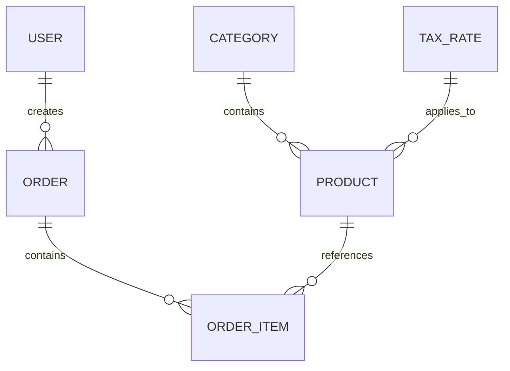

# Data Model: Phase 1 - Core Domain Entities, Fast PIN Auth & Hybrid Persistence

**Feature**: `003-phase1-core-pin-persistence`
**Date**: 2026-08-15
**Status**: Complete

## 1. Domain Entities & Roles

### User (Staff Operator)
Represents an authorized restaurant employee operating the POS.

| Field | Type | Constraints | Description |
| :--- | :--- | :--- | :--- |
| `Id` | `Guid` (UUIDv7) | Primary Key, Non-null | Unique operator identifier |
| `Name` | `string` | Max 64 chars, Non-null | Display name (e.g., "Alexandre Dupont") |
| `Role` | `UserRole` | Enum (`Waiter = 0`, `Cashier = 1`, `KitchenStaff = 2`, `FloorManager = 3`, `Admin = 4`) | RBAC role determining station permissions |
| `PinHash` | `string` | 64 hex chars (SHA-256) | Salted cryptographic hash of the numeric PIN |
| `PinSalt` | `string` | 32 hex chars (16 bytes random) | Unique cryptographic salt |
| `IsActive` | `bool` | Default `true` | Staff employment status |
| `UpdatedAtUtc` | `DateTimeOffset` | UTC, Non-null | Timestamp for sync tracking |

---

### Product (Menu Item)
Represents a sellable catalog item.

| Field | Type | Constraints | Description |
| :--- | :--- | :--- | :--- |
| `Id` | `Guid` (UUIDv7) | Primary Key, Non-null | Unique product identifier |
| `Name` | `string` | Max 100 chars, Non-null | Item title (e.g., "Burger Maison & Frites") |
| `CategoryId` | `string` | Foreign Key, Non-null | Parent category identifier |
| `Price` | `Money` | Value Object (cents) | Retail selling price TTC |
| `TaxRatePercent` | `decimal` | Precision (5,2), e.g., `10.00` | Applicable VAT percentage |
| `ColorHex` | `string?` | e.g., `#10B981` | Button accent color on POS screen |
| `IsAvailable` | `bool` | Default `true` | Stock availability status (86 flag) |
| `UpdatedAtUtc` | `DateTimeOffset` | UTC, Non-null | Timestamp for sync tracking |

---

### Category (Catalog Section)
Groups products logically for intuitive tactile navigation.

| Field | Type | Constraints | Description |
| :--- | :--- | :--- | :--- |
| `Id` | `string` | Primary Key, Max 32 chars | Stable category code (e.g., `CAT-DRINKS`) |
| `Name` | `string` | Max 64 chars, Non-null | Category label (e.g., "Boissons Fraîches") |
| `ColorHex` | `string?` | Hex color code | Category button theme |
| `DisplayOrder` | `int` | $\ge 0$ | UI ordering priority |
| `UpdatedAtUtc` | `DateTimeOffset` | UTC, Non-null | Timestamp for sync tracking |

---

### TaxRate (Statutory Tax Specification)
Defines regulatory tax categories.

| Field | Type | Constraints | Description |
| :--- | :--- | :--- | :--- |
| `Id` | `Guid` | Primary Key | Tax rate ID |
| `Code` | `string` | Max 16 chars (e.g., `TVA_10`) | Short code |
| `RatePercent` | `decimal` | Precision (5,2) | Tax percentage (e.g., `10.00`) |
| `Description` | `string` | Max 64 chars | Description (e.g., "Restauration / Vente à emporter") |
| `IsDefault` | `bool` | Default `false` | Default tax rate for new products |

---

## 2. Entity Relationships Diagram

