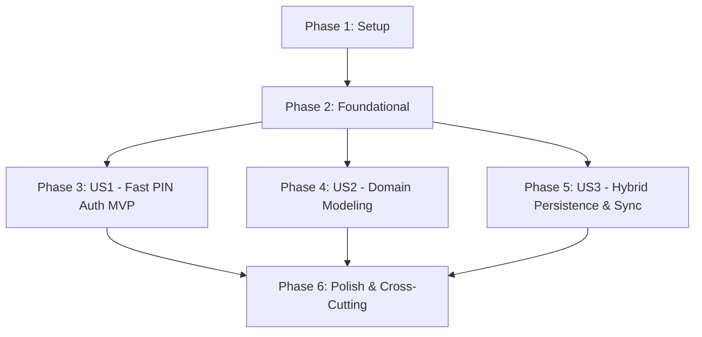

# Implementation Tasks: Phase 1 - Core Domain Entities, Fast PIN Authentication & Hybrid Persistence

**Feature**: `003-phase1-core-pin-persistence`
**Specification**: [specs/003-phase1-core-pin-persistence/spec.md](spec.md)
**Implementation Plan**: [specs/003-phase1-core-pin-persistence/plan.md](plan.md)
**Status**: Completed

---

## Phase 1: Setup (Shared Infrastructure & Multi-Project Solution Wiring)

**Purpose**: Project initialization, infrastructure dependencies, and test project wiring.

- [X] T001 Setup `RestaurantPos.Infrastructure` project file `src/RestaurantPos.Infrastructure/RestaurantPos.Infrastructure.csproj` targeting `net9.0` with EF Core, Npgsql, and SQLite dependencies
- [X] T002 [P] Setup integration test project `tests/RestaurantPos.Domain.Tests/RestaurantPos.Domain.Tests.csproj` with xUnit, FluentAssertions, and Moq
- [X] T003 [P] Setup integration test project `tests/RestaurantPos.Infrastructure.Tests/RestaurantPos.Infrastructure.Tests.csproj` with EF Core in-memory/SQLite providers

---

## Phase 2: Foundational (Core Entities, Hashing Interfaces & EF Core Multi-Provider Context)

**Purpose**: Core entity models, authentication contracts, and multi-provider EF Core context that MUST be complete before user stories begin.

**⚠️ CRITICAL**: All user stories depend on these foundational components.

- [X] T004 [P] Define `TaxRate` domain entity in `src/RestaurantPos.Domain/Entities/TaxRate.cs` with validation rules
- [X] T005 [P] Define `User` operator entity in `src/RestaurantPos.Domain/Entities/User.cs` with `UserRole` enum and salt/hash properties
- [X] T006 [P] Define `IOperatorAuthenticationService` interface in `src/RestaurantPos.Application/Common/Interfaces/IOperatorAuthenticationService.cs`
- [X] T007 Setup EF Core multi-provider `AppDbContext` in `src/RestaurantPos.Infrastructure/Persistence/AppDbContext.cs` mapping `User`, `Product`, `Category`, and `TaxRate`

**Checkpoint**: Core domain models, interfaces, and database mapping ready.

---

## Phase 3: User Story 1 - Express Operator PIN Authentication & Role-Based Access (Priority: P1) 🎯 MVP

**Goal**: Enable waitstaff, bartenders, and managers to log in and unlock POS terminals in $< 50\text{ms}$ with salted cryptographic PIN hashing and 100% offline capability.

**Independent Test**: Disconnect network (offline mode). Enter valid and invalid 4-6 digit PIN codes on the touchscreen keypad. Verify instant $< 50\text{ms}$ authentication, role assignment, and haptic feedback.

### Tests for User Story 1

- [X] T008 [P] [US1] Create unit tests for salted PIN hashing and verification in `tests/RestaurantPos.Infrastructure.Tests/OperatorAuthenticationServiceTests.cs`
- [X] T009 [P] [US1] Create unit tests for tactile PIN entry and session lock in `tests/RestaurantPos.Client.Maui.Tests/PinLockViewModelTests.cs`

### Implementation for User Story 1

- [X] T010 [US1] Implement `OperatorAuthenticationService` in `src/RestaurantPos.Infrastructure/Security/OperatorAuthenticationService.cs` using SHA-256 and cryptographic salt
- [X] T011 [US1] Connect `PinLockViewModel` in `src/RestaurantPos.Client.Maui/ViewModels/PinLockViewModel.cs` to local credential validation with $< 50\text{ms}$ execution and haptic triggers
- [X] T012 [US1] Implement tactile PIN lock screen XAML layout in `src/RestaurantPos.Client.Maui/Views/PinLockPage.xaml` and `src/RestaurantPos.Client.Maui/Views/PinLockPage.xaml.cs`

**Checkpoint**: User Story 1 (Express PIN Authentication) is fully functional and independently testable offline (MVP Ready).

---

## Phase 4: User Story 2 - Shared Master Data & Entity Domain Modeling (Priority: P1)

**Goal**: Deliver strongly typed, immutable domain models for `User`, `Product`, `Category`, `TaxRate`, and `ModifierGroup` with exact decimal cent arithmetic.

**Independent Test**: Execute domain test suite validating product catalog calculations, line item tax splits across multiple VAT brackets (5.5%, 10%, 20%), and role-based permissions without floating-point errors.

### Tests for User Story 2

- [X] T013 [P] [US2] Create unit tests for product tax split and decimal cent math in `tests/RestaurantPos.Domain.Tests/ProductTaxCalculationTests.cs`
- [X] T014 [P] [US2] Create unit tests for role permission boundaries in `tests/RestaurantPos.Domain.Tests/UserRoleAuthorizationTests.cs`

### Implementation for User Story 2

- [X] T015 [US2] Implement category and modifier group domain models in `src/RestaurantPos.Domain/Entities/ModifierGroup.cs`
- [X] T016 [US2] Implement comprehensive entity validation and money domain logic in `src/RestaurantPos.Domain/Entities/Product.cs`

**Checkpoint**: User Stories 1 AND 2 are complete and verified.

---

## Phase 5: User Story 3 - Multi-Provider Hybrid Persistence & Local Catalog Synchronization (Priority: P2)

**Goal**: Asynchronously synchronize central product catalogs, tax rates, and staff credential hashes into the local sandboxed SQLite database.

**Independent Test**: Seed central server with 500 items, trigger delta sync, verify all items and categories are persisted in local SQLite cache, disconnect network, and verify zero-latency local catalog queries.

### Tests for User Story 3

- [X] T017 [P] [US3] Create integration tests for catalog delta sync in `tests/RestaurantPos.Infrastructure.Tests/CatalogSyncServiceTests.cs`
- [X] T018 [P] [US3] Create integration tests for local SQLite schema seeding in `tests/RestaurantPos.Infrastructure.Tests/LocalAppDbContextMappingTests.cs`

### Implementation for User Story 3

- [X] T019 [US3] Implement `ICatalogSyncService` and `CatalogSyncService` in `src/RestaurantPos.Infrastructure/Services/CatalogSyncService.cs`
- [X] T020 [US3] Implement local SQLite catalog cache update transaction in `src/RestaurantPos.Client.Maui/Persistence/LocalAppDbContext.cs`

**Checkpoint**: All three user stories are complete and integrated.

---

## Phase 6: Polish & Cross-Cutting Concerns

**Purpose**: Build automation, performance benchmarks, and quality verification.

- [X] T021 [P] Create automated verification script in `scripts/powershell/verify-phase1-core-pin.ps1`
- [X] T022 Execute full quickstart verification scenarios per `specs/003-phase1-core-pin-persistence/quickstart.md`
- [X] T023 Roslyn warning cleanup and code documentation updates across Phase 1 modules

---

## Dependencies & Execution Order

### Phase Dependencies

