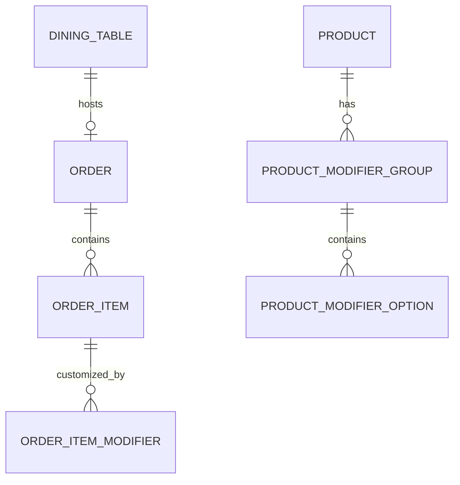

# Data Model: Phase 2 - Tactile Order Entry, 2D Floor Plan & Modifiers

**Feature**: `004-phase2-order-floorplan-modifiers`
**Date**: 2026-08-15
**Status**: Complete

## 1. Dining Room & Table Entities

### DiningTable
Represents a physical table in the restaurant dining room.

| Field | Type | Constraints | Description |
| :--- | :--- | :--- | :--- |
| `TableNumber` | `string` | Primary Key, Max 16 chars | Table identifier (e.g., "T01", "Bar 02", "Terrasse 05") |
| `Capacity` | `int` | $\ge 1$ | Seating capacity |
| `Status` | `TableStatus` | Enum (`Free = 0`, `Occupied = 1`, `BillRequested = 2`, `Paid = 3`) | Current occupancy state |
| `PositionX` | `double` | $\ge 0$ | 2D X-coordinate on floor plan |
| `PositionY` | `double` | $\ge 0$ | 2D Y-coordinate on floor plan |
| `AssignedWaiterName`| `string?`| Max 64 chars | Name of active server managing table |
| `CoversCount` | `int` | $\ge 0$ | Number of active seated guests |
| `ActiveOrderId` | `Guid?` | UUIDv7 | Foreign Key to active `Order` |
| `OpenedAtUtc` | `DateTimeOffset?` | UTC | Table occupation start timestamp |

---

## 2. Product Modifier Entities

### ProductModifierGroup
Defines a set of preparation choices associated with dishes.

| Field | Type | Constraints | Description |
| :--- | :--- | :--- | :--- |
| `Id` | `Guid` (UUIDv7) | Primary Key | Modifier group identifier |
| `ProductId` | `Guid` | Foreign Key | Associated product ID |
| `GroupName` | `string` | Max 64 chars | Name (e.g. "Cuisson", "Sauce", "Suppléments") |
| `MinSelections` | `int` | $\ge 0$ | Minimum required choices ($1 =$ mandatory) |
| `MaxSelections` | `int` | $\ge 1$ | Maximum allowable choices ($1 =$ single-choice) |
| `DisplayOrder` | `int` | $\ge 0$ | Ordering in popup modal |

---

### ProductModifierOption
A specific selectable choice within a group.

| Field | Type | Constraints | Description |
| :--- | :--- | :--- | :--- |
| `Id` | `Guid` (UUIDv7) | Primary Key | Option identifier |
| `GroupId` | `Guid` | Foreign Key | Parent modifier group |
| `Name` | `string` | Max 64 chars | Option label (e.g. "Saignant", "Sauce Poivre", "Bacon") |
| `ExtraPrice` | `Money` | Value Object | Surcharge in cents (0.00 € if included) |
| `IsDefault` | `bool` | Default `false` | Pre-selected default |

---

## 3. Order Item Modifier Association

