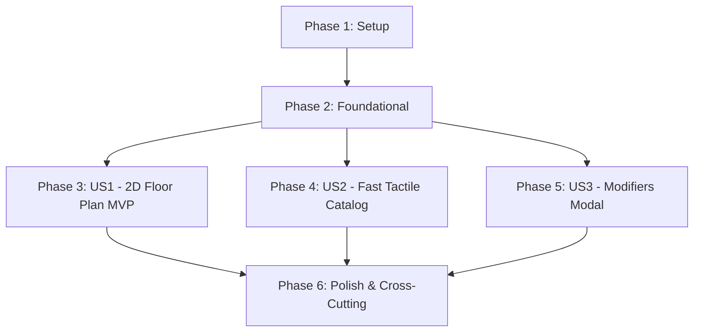

# Implementation Tasks: Phase 2 - Tactile Order Entry, Interactive 2D Floor Plan & Modifiers

**Feature**: `004-phase2-order-floorplan-modifiers`
**Specification**: [specs/004-phase2-order-floorplan-modifiers/spec.md](spec.md)
**Implementation Plan**: [specs/004-phase2-order-floorplan-modifiers/plan.md](plan.md)
**Status**: Completed

---

## Phase 1: Setup (Shared Entities & Persistence Mapping)

**Purpose**: Define table and modifier models in `Domain` and map them in EF Core contexts.

- [X] T001 [P] Define `DiningTable` domain entity in `src/RestaurantPos.Domain/Entities/DiningTable.cs` with table status, coordinates, and active order mapping
- [X] T002 [P] Define `ProductModifierGroup` and `ProductModifierOption` domain entities in `src/RestaurantPos.Domain/Entities/ProductModifierGroup.cs`
- [X] T003 [P] Update `AppDbContext` and `LocalAppDbContext` in `src/RestaurantPos.Infrastructure/Persistence/AppDbContext.cs` and `src/RestaurantPos.Client.Maui/Persistence/LocalAppDbContext.cs` to map `DiningTables`, `ModifierGroups`, and `ModifierOptions`

---

## Phase 2: Foundational (Table Management & Modifier Contracts)

**Purpose**: Core interfaces and business logic services required across all order-taking flows.

**⚠️ CRITICAL**: All user stories depend on these foundational components.

- [X] T004 [P] Define `ITableManagementService` interface in `src/RestaurantPos.Application/Common/Interfaces/ITableManagementService.cs`
- [X] T005 [P] Define `IModifierValidationService` and `SelectedModifier` value objects in `src/RestaurantPos.Application/Common/Interfaces/IModifierValidationService.cs`
- [X] T006 Implement `TableManagementService` in `src/RestaurantPos.Infrastructure/Services/TableManagementService.cs`
- [X] T007 Implement `ModifierValidationService` in `src/RestaurantPos.Infrastructure/Services/ModifierValidationService.cs`

**Checkpoint**: Foundation ready - table and modifier validation services operational.

---

## Phase 3: User Story 1 - Interactive 2D Floor Plan Navigation & Real-Time Table Status (Priority: P1) 🎯 MVP

**Goal**: Provide an interactive 2D floor plan with real-time table status color coding and $< 100\text{ms}$ table switching.

**Independent Test**: Display floor plan with varied table states. Tap tables; verify instant $< 100\text{ms}$ context switch to active table note with haptic feedback.

### Tests for User Story 1

- [X] T008 [P] [US1] Create unit tests for table status transitions and table transfers in `tests/RestaurantPos.Infrastructure.Tests/TableManagementServiceTests.cs`
- [X] T009 [P] [US1] Create unit tests for `FloorPlanViewModel` table switching in `tests/RestaurantPos.Client.Maui.Tests/FloorPlanViewModelTests.cs`

### Implementation for User Story 1

- [X] T010 [US1] Implement enhanced `FloorPlanViewModel` in `src/RestaurantPos.Client.Maui/ViewModels/FloorPlanViewModel.cs` with real-time status and covers prompt
- [X] T011 [US1] Implement interactive 2D floor plan view in `src/RestaurantPos.Client.Maui/Views/FloorPlanPage.xaml` and `src/RestaurantPos.Client.Maui/Views/FloorPlanPage.xaml.cs`

**Checkpoint**: User Story 1 (Interactive Floor Plan) is fully functional and testable (MVP Ready).

---

## Phase 4: User Story 2 - Ultra-Fast Tactile Product Catalog & Rush-Hour Quick Keys (Priority: P1)

**Goal**: Deliver a responsive catalog grid with $\ge 80\text{px}$ category tabs and quick keys allowing item addition in $\le 2$ taps with $< 16\text{ms}$ recalculations.

**Independent Test**: Tap category tab $\to$ tap product tile; verify item added to cart with updated totals and VAT breakdown in $\le 2$ taps.

### Tests for User Story 2

- [X] T012 [P] [US2] Create unit tests for two-tap item selection and basket aggregation in `tests/RestaurantPos.Client.Maui.Tests/PosTerminalViewModelTests.cs`

### Implementation for User Story 2

- [X] T013 [US2] Implement tactile catalog grid control `src/RestaurantPos.Client.Maui/Controls/CatalogGrid.xaml` and `src/RestaurantPos.Client.Maui/Controls/CatalogGrid.xaml.cs` with category tabs ($\ge 80\text{px}$)
- [X] T014 [US2] Enhance `PosTerminalViewModel` in `src/RestaurantPos.Client.Maui/ViewModels/PosTerminalViewModel.cs` to integrate quick keys and sub-16ms reactive calculations

**Checkpoint**: User Stories 1 AND 2 are complete and verified.

---

## Phase 5: User Story 3 - Modal Modifier Selection, Cooking Temperatures & Extras (Priority: P2)

**Goal**: Provide a tactile modal popup for cooking temperatures, sauces, and extra charges with mandatory single-choice and optional multi-choice rules.

**Independent Test**: Tap configured steak item $\to$ select "Saignant" + "Sauce Poivre (+2.00 €)"; verify line item price and taxes update accurately.

### Tests for User Story 3

- [X] T015 [P] [US3] Create unit tests for mandatory single-choice and optional multi-choice modifier rules in `tests/RestaurantPos.Infrastructure.Tests/ModifierValidationTests.cs`
- [X] T016 [P] [US3] Create unit tests for `ModifiersViewModel` line pricing in `tests/RestaurantPos.Client.Maui.Tests/ModifiersViewModelTests.cs`

### Implementation for User Story 3

- [X] T017 [US3] Implement `ModifiersViewModel` in `src/RestaurantPos.Client.Maui/ViewModels/ModifiersViewModel.cs` with validation and haptics
- [X] T018 [US3] Implement tactile modifiers modal view in `src/RestaurantPos.Client.Maui/Views/ModifiersModal.xaml` and `src/RestaurantPos.Client.Maui/Views/ModifiersModal.xaml.cs`

**Checkpoint**: All three user stories are complete and integrated.

---

## Phase 6: Polish & Cross-Cutting Concerns

**Purpose**: Build automation, performance benchmarks, and quality verification.

- [X] T019 [P] Create automated verification script in `scripts/powershell/verify-phase2-order-floorplan.ps1`
- [X] T020 Execute full quickstart verification scenarios per `specs/004-phase2-order-floorplan-modifiers/quickstart.md`
- [X] T021 Roslyn warning cleanup and code documentation updates across Phase 2 modules

---

## Dependencies & Execution Order

### Phase Dependencies

