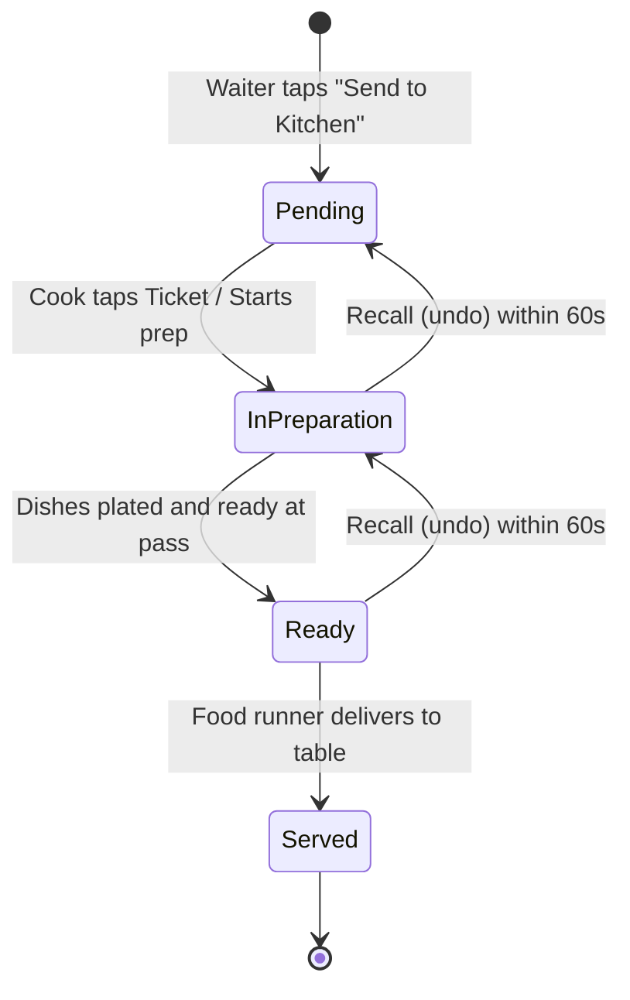

# Data Model: Phase 3 - Kitchen Display System (KDS) & Real-Time Routing

**Feature**: `005-phase3-kds-realtime-routing`
**Date**: 2026-08-15
**Status**: Complete

## 1. Kitchen Ticket Entities

### KitchenTicket
Represents a preparation ticket sent to one or more kitchen stations.

| Field | Type | Constraints | Description |
| :--- | :--- | :--- | :--- |
| `Id` | `Guid` (UUIDv7) | Primary Key | Unique ticket identifier |
| `OrderId` | `Guid` | Foreign Key | Originating POS order ID |
| `TableNumber` | `string` | Max 16 chars, Non-null | Table identifier (e.g. "T12") |
| `ServerName` | `string` | Max 64 chars | Server who took the order |
| `CoversCount` | `int` | $\ge 1$ | Number of dining guests |
| `StationId` | `string` | Max 32 chars | Assigned station (`HotKitchen`, `Bar`, etc.) |
| `Status` | `TicketStatus` | Enum (`Pending = 0`, `InPreparation = 1`, `Ready = 2`, `Served = 3`) | Current lifecycle state |
| `DispatchedAtUtc`| `DateTimeOffset` | UTC | Time sent to kitchen |
| `CompletedAtUtc` | `DateTimeOffset?`| UTC | Time served / completed |

---

### KitchenTicketItem
Represents an individual dish line item on the ticket.

| Field | Type | Constraints | Description |
| :--- | :--- | :--- | :--- |
| `Id` | `Guid` (UUIDv7) | Primary Key | Unique item line identifier |
| `TicketId` | `Guid` | Foreign Key | Parent ticket ID |
| `ProductId` | `Guid` | Foreign Key | Associated catalog product ID |
| `ProductName` | `string` | Max 100 chars | Dish name (e.g. "Entrecôte 250g") |
| `Quantity` | `int` | $\ge 1$ | Ordered quantity |
| `ModifiersSummary`| `string?` | e.g. "Saignant, Sauce Poivre" | Formatted modifier text |
| `KitchenComment` | `string?` | Max 256 chars | Special instructions or allergies |
| `Status` | `TicketItemStatus` | Enum (`Pending = 0`, `InPrep = 1`, `Ready = 2`) | Line item preparation state |

---

### PreparationStation
Represents a physical workstation in the kitchen.

| Field | Type | Constraints | Description |
| :--- | :--- | :--- | :--- |
| `Id` | `string` | Primary Key (e.g. `STATION-HOT`) | Station identifier |
| `Name` | `string` | Max 64 chars | Display name (e.g. "Cuisine Chaude") |
| `SignalRGroup` | `string` | e.g. `Group_Station_HotKitchen` | SignalR broadcast group |
| `CategoryIdsJson`| `string` | JSON Array | Mapped category IDs (e.g. `["CAT-MAINS"]`) |

---

## 2. Kitchen Lifecycle Diagram

