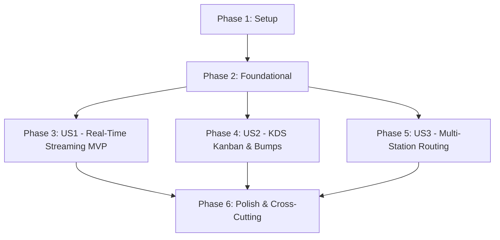

# Implementation Tasks: Phase 3 - Kitchen Display System (KDS) & Real-Time Order Routing

**Feature**: `005-phase3-kds-realtime-routing`
**Specification**: [specs/005-phase3-kds-realtime-routing/spec.md](spec.md)
**Implementation Plan**: [specs/005-phase3-kds-realtime-routing/plan.md](plan.md)
**Status**: Completed

---

## Phase 1: Setup (ASP.NET Core API Project & Entities)

**Purpose**: Initialize backend API project, SignalR dependencies, and KDS domain models.

- [X] T001 Setup `src/RestaurantPos.Api/RestaurantPos.Api.csproj` targeting `net9.0` with SignalR and EF Core dependencies
- [X] T002 [P] Define `KitchenTicket`, `KitchenTicketItem`, and `PreparationStation` entities in `src/RestaurantPos.Domain/Entities/KitchenTicket.cs`
- [X] T003 [P] Update `AppDbContext` in `src/RestaurantPos.Infrastructure/Persistence/AppDbContext.cs` to map `KitchenTickets`, `KitchenTicketItems`, and `PreparationStations`

---

## Phase 2: Foundational (SignalR Contracts & Routing Services)

**Purpose**: Core interfaces and business logic services required across real-time kitchen flows.

**⚠️ CRITICAL**: All user stories depend on these foundational components.

- [X] T004 [P] Define `IKitchenHubClient`, `IKitchenHubServer`, and `IKitchenRoutingService` in `src/RestaurantPos.Application/Common/Interfaces/IKitchenRoutingService.cs`
- [X] T005 Implement `KitchenRoutingService` in `src/RestaurantPos.Infrastructure/Services/KitchenRoutingService.cs` for order splitting by category/station
- [X] T006 Implement `KitchenHub` SignalR hub in `src/RestaurantPos.Api/Hubs/KitchenHub.cs` with station group joins/leaves and broadcast events

**Checkpoint**: Foundation ready - SignalR hub and routing services operational.

---

## Phase 3: User Story 1 - Real-Time Kitchen Order Streaming & SignalR Hub (Priority: P1) 🎯 MVP

**Goal**: Deliver real-time order dispatch to kitchen screens in $< 200\text{ms}$ with auto-reconnecting SignalR WebSocket client.

**Independent Test**: Connect KDS client to `KitchenHub`. Dispatch an order from POS; verify instant $< 200\text{ms}$ ticket arrival with table number and modifiers.

### Tests for User Story 1

- [X] T007 [P] [US1] Create unit tests for order splitting and station assignment in `tests/RestaurantPos.Infrastructure.Tests/KitchenRoutingServiceTests.cs`
- [X] T008 [P] [US1] Create integration tests for `KitchenHub` client message streaming in `tests/RestaurantPos.Infrastructure.Tests/KitchenHubTests.cs`

### Implementation for User Story 1

- [X] T009 [US1] Implement SignalR client service in `src/RestaurantPos.Client.Maui/Services/KitchenSignalRClient.cs` with auto-reconnection and event listeners

**Checkpoint**: User Story 1 (Real-Time Order Streaming) is functional and testable (MVP Ready).

---

## Phase 4: User Story 2 - Touch-First KDS Ticket Lifecycle & State Transitions (Priority: P1)

**Goal**: Provide a tactile Kanban interface with columns (`Pending`, `InPrep`, `Ready`, `Served`), 1-second timers, and one-tap bump actions.

**Independent Test**: Tap ticket header $\to$ bumps from Pending $\to$ InPreparation $\to$ Ready $\to$ Served in $< 50\text{ms}$. Tap Recall within 60s to undo.

### Tests for User Story 2

- [X] T010 [P] [US2] Create unit tests for ticket bump transitions and recall in `tests/RestaurantPos.Client.Maui.Tests/KdsViewModelTests.cs`

### Implementation for User Story 2

- [X] T011 [US2] Implement `KdsViewModel` in `src/RestaurantPos.Client.Maui/ViewModels/KdsViewModel.cs` with reactive columns, 1-second elapsed timers, and haptics
- [X] T012 [US2] Implement full-screen tactile KDS Kanban view in `src/RestaurantPos.Client.Maui/Views/KdsPage.xaml` and `src/RestaurantPos.Client.Maui/Views/KdsPage.xaml.cs`

**Checkpoint**: User Stories 1 AND 2 are complete and verified.

---

## Phase 5: User Story 3 - Multi-Station Preparation Routing (Priority: P2)

**Goal**: Split orders across designated workstation screens (Bar, Hot Kitchen, Pastry) based on item category.

**Independent Test**: Submit a mixed order (Drink + Steak + Dessert); verify Bar receives Drink, Hot Kitchen receives Steak, and Pastry receives Dessert.

### Tests for User Story 3

- [X] T013 [P] [US3] Create integration tests for multi-station ticket segregation in `tests/RestaurantPos.Infrastructure.Tests/MultiStationRoutingTests.cs`

### Implementation for User Story 3

- [X] T014 [US3] Implement station profile filter in `src/RestaurantPos.Client.Maui/ViewModels/KdsViewModel.cs` allowing stations to display only designated preparation lines

**Checkpoint**: All three user stories are complete and integrated.

---

## Phase 6: Polish & Cross-Cutting Concerns

**Purpose**: Build automation, performance benchmarks, and quality verification.

- [X] T015 [P] Create automated verification script in `scripts/powershell/verify-phase3-kds-routing.ps1`
- [X] T016 Execute full quickstart verification scenarios per `specs/005-phase3-kds-realtime-routing/quickstart.md`
- [X] T017 Roslyn warning cleanup and code documentation updates across Phase 3 modules

---

## Dependencies & Execution Order

### Phase Dependencies

