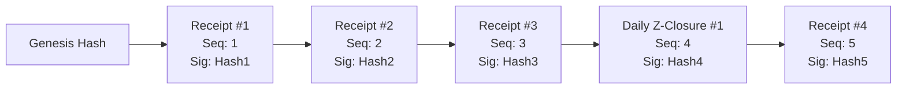

# Data Model: Phase 4 - Multi-Payment Checkout, Split Bill & NF525 Fiscal Audit

**Feature**: `006-phase4-checkout-nf525-splitbill`
**Date**: 2026-08-15
**Status**: Complete

## 1. Fiscal Transaction Entities

### FiscalReceipt
Represents an immutable receipt issued upon payment checkout.

| Field | Type | Constraints | Description |
| :--- | :--- | :--- | :--- |
| `Id` | `Guid` (UUIDv7) | Primary Key | Unique receipt ID |
| `TerminalId` | `string` | Max 16 chars (e.g. "POS01") | Originating POS terminal |
| `ReceiptNumber` | `string` | Format `POS01-001042` | Monotonic sequential receipt number |
| `OrderId` | `Guid` | Foreign Key | Associated order ID |
| `SequenceNumber`| `long` | Monotonically increasing | Sequential index within terminal |
| `TotalTtcAmount`| `Money` | Value Object | Total amount inclusive of VAT |
| `TotalHtAmount` | `Money` | Value Object | Total amount exclusive of VAT |
| `TaxBreakdownJson`| `string` | JSON payload | VAT per rate (5.5%, 10%, 20%) |
| `PaymentTendersJson`| `string`| JSON payload | Tender breakdown (Cash, Card, etc.) |
| `PreviousSignatureHash`| `string` | 64 chars Hex (SHA-256) | Hash of preceding receipt |
| `SignatureHash` | `string` | 64 chars Hex (SHA-256) | Chained cryptographic signature |
| `CreatedAtUtc` | `DateTimeOffset` | UTC | Immutable timestamp |

---

### DailyFiscalClosure (Z-Report)
Represents an immutable daily fiscal sealing record.

| Field | Type | Constraints | Description |
| :--- | :--- | :--- | :--- |
| `Id` | `Guid` (UUIDv7) | Primary Key | Unique closure identifier |
| `TerminalId` | `string` | Max 16 chars | Terminal identifier |
| `ClosureSequence`| `long` | Monotonic ($\ge 1$) | Daily Z sequence number |
| `PeriodStartUtc`| `DateTimeOffset` | UTC | Shift opening timestamp |
| `PeriodEndUtc` | `DateTimeOffset` | UTC | Shift closing timestamp |
| `TotalSalesTtc` | `Money` | Value Object | Total daily turnover TTC |
| `TotalSalesHt` | `Money` | Value Object | Total daily turnover HT |
| `TaxesSummaryJson`| `string` | JSON payload | Accumulated taxes per rate |
| `TenderTotalsJson`| `string` | JSON payload | Sales by payment method |
| `PerpetualGrandTotalCents`| `long` | Perpetual cumulative | Lifetime turnover since inception |
| `PreviousSignatureHash`| `string` | 64 chars Hex | Preceding chain signature |
| `SignatureHash` | `string` | 64 chars Hex | Sealing signature |
| `SealedByUserName`| `string` | Max 64 chars | Authorizing manager |

---

## 2. Cryptographic Hash Chain Diagram

