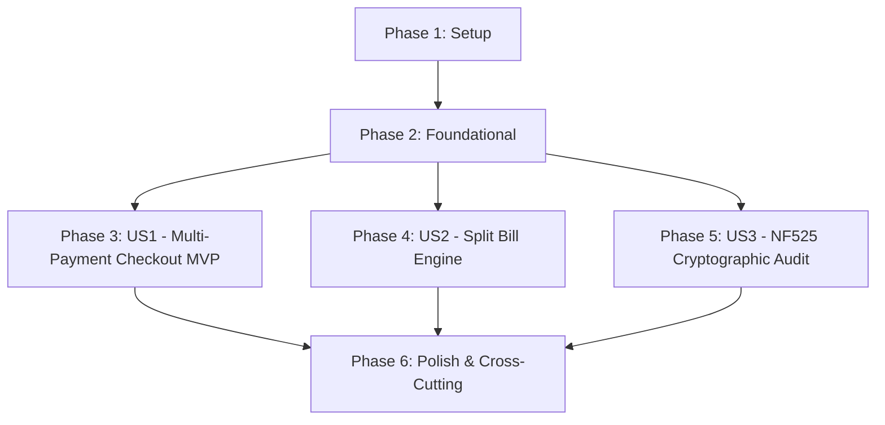

# Implementation Tasks: Phase 4 - Multi-Payment Checkout, Split Bill & NF525 Fiscal Audit Chain

**Feature**: `006-phase4-checkout-nf525-splitbill`
**Specification**: [specs/006-phase4-checkout-nf525-splitbill/spec.md](spec.md)
**Implementation Plan**: [specs/006-phase4-checkout-nf525-splitbill/plan.md](plan.md)
**Status**: Completed

---

## Phase 1: Setup (Domain Entities & Persistence Mapping)

**Purpose**: Define fiscal and tender entities in `Domain` and map them in EF Core contexts.

- [X] T001 [P] Define `FiscalReceipt`, `DailyFiscalClosure`, and `PaymentTender` domain entities in `src/RestaurantPos.Domain/Entities/FiscalReceipt.cs`
- [X] T002 [P] Update `AppDbContext` and `LocalAppDbContext` in `src/RestaurantPos.Infrastructure/Persistence/AppDbContext.cs` and `src/RestaurantPos.Client.Maui/Persistence/LocalAppDbContext.cs` to map `FiscalReceipts` and `DailyFiscalClosures`

---

## Phase 2: Foundational (Contracts & Core Fiscal Services)

**Purpose**: Core interfaces and business logic services required across payment settlement and NF525 auditing.

**⚠️ CRITICAL**: All user stories depend on these foundational components.

- [X] T003 [P] Define `ICheckoutPaymentService` and `INF525FiscalAuditService` contracts in `src/RestaurantPos.Application/Common/Interfaces/ICheckoutPaymentService.cs` and `src/RestaurantPos.Application/Common/Interfaces/INF525FiscalAuditService.cs`
- [X] T004 Implement `NF525FiscalAuditService` in `src/RestaurantPos.Infrastructure/Services/NF525FiscalAuditService.cs` with SHA-256 cryptographic hash chaining, X-reports, and Z-closures
- [X] T005 Implement `CheckoutPaymentService` in `src/RestaurantPos.Infrastructure/Services/CheckoutPaymentService.cs` with multi-tender payment processing, change calculation, and split-bill zero-loss remainder distribution

**Checkpoint**: Foundation ready - checkout payment and NF525 fiscal audit services operational.

---

## Phase 3: User Story 1 - Multi-Payment Settlement & Change Calculation (Priority: P1) 🎯 MVP

**Goal**: Deliver high-speed tactile multi-tender checkout with instant change calculation in $< 500\text{ms}$.

**Independent Test**: Pay an order using mixed Cash and Meal Voucher. Verify change is displayed instantly, table moves to `Paid`, and fiscal receipt is recorded.

### Tests for User Story 1

- [X] T006 [P] [US1] Create unit tests for multi-tender checkout, cash change calculation, and table closure in `tests/RestaurantPos.Infrastructure.Tests/CheckoutPaymentServiceTests.cs`
- [X] T007 [P] [US1] Create unit tests for `CheckoutViewModel` in `tests/RestaurantPos.Client.Maui.Tests/CheckoutViewModelTests.cs`

### Implementation for User Story 1

- [X] T008 [US1] Implement `CheckoutViewModel` in `src/RestaurantPos.Client.Maui/ViewModels/CheckoutViewModel.cs` with rapid cash buttons (10€, 20€, 50€), real-time change calculation, and haptic feedback
- [X] T009 [US1] Implement tactile payment modal view in `src/RestaurantPos.Client.Maui/Views/PaymentModal.xaml` and `src/RestaurantPos.Client.Maui/Views/PaymentModal.xaml.cs`

**Checkpoint**: User Story 1 (Multi-Payment Checkout) is functional and testable (MVP Ready).

---

## Phase 4: User Story 2 - Tactile Split Bill & Seat-Based Partitioning (Priority: P1)

**Goal**: Divide dining checks equally across $N$ guests or by selecting individual dishes with zero cent loss.

**Independent Test**: Divide 100.00 € by 3 guests. Verify partitions are 33.34 €, 33.33 €, 33.33 € strictly summing to 100.00 €.

### Tests for User Story 2

- [X] T010 [P] [US2] Create unit tests for zero-loss split-bill remainder distribution and seat partitioning in `tests/RestaurantPos.Infrastructure.Tests/SplitBillCalculationTests.cs`
- [X] T011 [P] [US2] Create unit tests for `SplitBillViewModel` in `tests/RestaurantPos.Client.Maui.Tests/SplitBillViewModelTests.cs`

### Implementation for User Story 2

- [X] T012 [US2] Implement `SplitBillViewModel` in `src/RestaurantPos.Client.Maui/ViewModels/SplitBillViewModel.cs` with equal split stepper and itemized selection
- [X] T013 [US2] Implement tactile split bill modal in `src/RestaurantPos.Client.Maui/Views/SplitBillModal.xaml` and `src/RestaurantPos.Client.Maui/Views/SplitBillModal.xaml.cs`

**Checkpoint**: User Stories 1 AND 2 are complete and verified.

---

## Phase 5: User Story 3 - NF525 Cryptographic Audit Hash Chain & Fiscal Closures (Priority: P1)

**Goal**: Maintain immutable SHA-256 transaction hash chaining, tamper detection, X-reports, and daily Z-closures.

**Independent Test**: Generate sequential receipts $\to$ verify 100% SHA-256 audit chain validity. Alter one record $\to$ audit fails. Perform daily Z-closure $\to$ perpetual cumulative grand totals seal.

### Tests for User Story 3

- [X] T014 [P] [US3] Create unit tests for SHA-256 hash chaining, tampering detection, X-reports, and daily Z-closures in `tests/RestaurantPos.Infrastructure.Tests/NF525FiscalAuditTests.cs`
- [X] T015 [US3] Implement `FiscalReportsViewModel` in `src/RestaurantPos.Client.Maui/ViewModels/FiscalReportsViewModel.cs` for manager PIN authorization and X/Z printing
- [X] T016 [US3] Implement fiscal thermal receipt printing formatter with legal VAT breakdown, signature, and QR code in `src/RestaurantPos.Client.Maui/Services/FiscalReceiptPrinterFormatter.cs`

**Checkpoint**: All three user stories are complete and integrated.

---

## Phase 6: Polish & Cross-Cutting Concerns

**Purpose**: Build automation, performance benchmarks, and quality verification.

- [X] T017 [P] Create automated verification script in `scripts/powershell/verify-phase4-checkout-nf525.ps1`
- [X] T018 Execute full quickstart verification scenarios per `specs/006-phase4-checkout-nf525-splitbill/quickstart.md`
- [X] T019 Roslyn warning cleanup and code documentation updates across Phase 4 modules

---

## Dependencies & Execution Order

### Phase Dependencies

