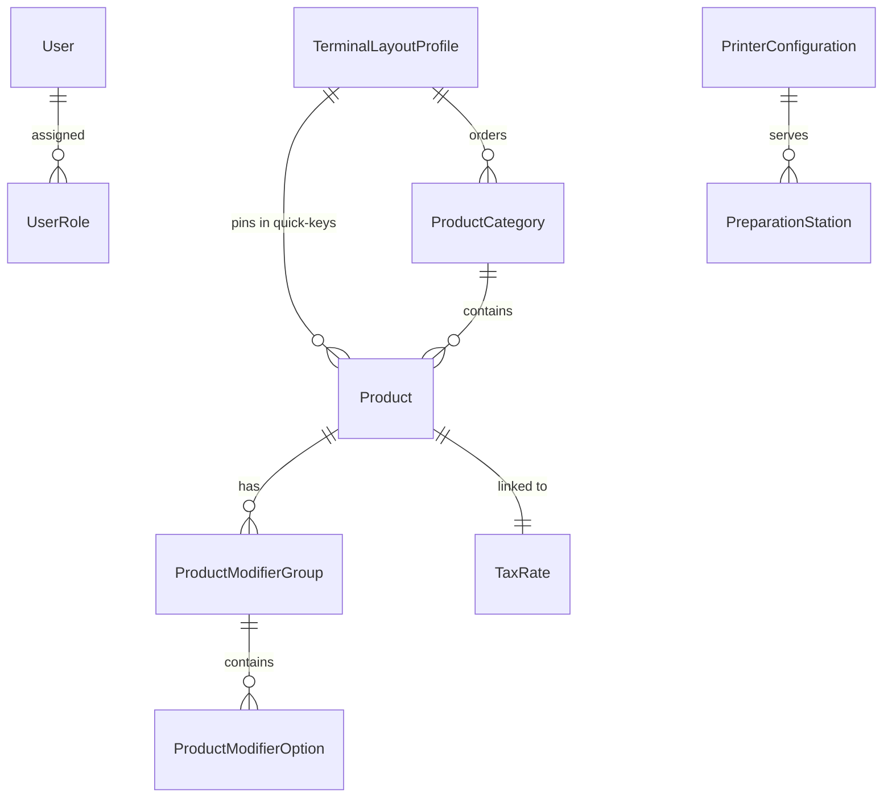
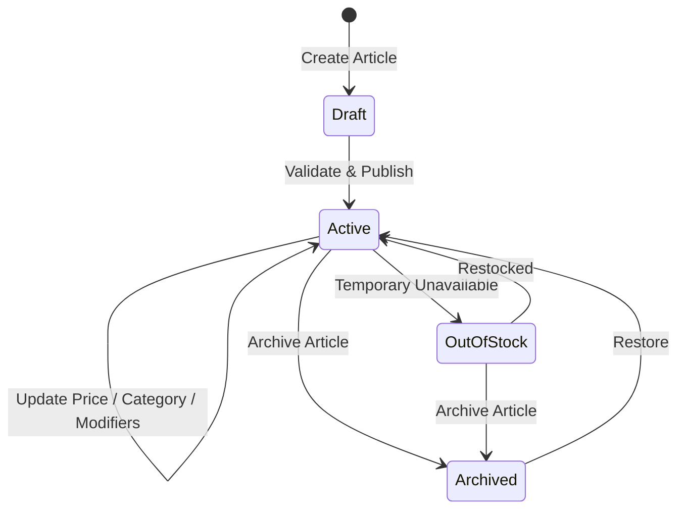
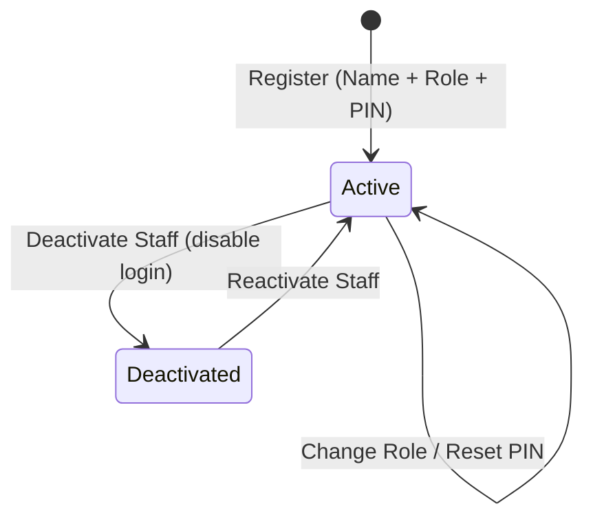

# Data Model: Configurable POS Management & Administration

**Feature**: `007-pos-configuration-management`  
**Date**: 2026-08-30  
**Status**: Completed

## 1. Entity Relationship Overview

---

## 2. Entities & Schemas

### 2.1 `ProductCategory`
Represents a menu department or food/beverage family for catalog segmentation.

| Field | Type | Constraints | Description |
|---|---|---|---|
| `Id` | `Guid` | Primary Key, Non-null | Unique identifier (UUIDv7) |
| `Name` | `string` | Max 100 chars, Non-null | Display name (e.g., "Entrées", "Boissons", "Plats") |
| `DisplayOrder` | `int` | $\ge 0$, Default 0 | Sort order for display tabs on sales screens |
| `ColorHex` | `string` | 7-9 chars (e.g. `#FF4B4B`) | Color code for tactile tab badge |
| `IconGlyph` | `string?` | Max 50 chars | Optional icon name or unicode glyph |
| `IsActive` | `bool` | Default `true` | Active status; `false` archives the category |
| `CreatedAt` | `DateTimeOffset` | Non-null, UTC | Creation timestamp |
| `UpdatedAt` | `DateTimeOffset` | Non-null, UTC | Last modification timestamp |

**Validation Rules**:
- `Name` must not be null or whitespace, length between 2 and 100 characters.
- `ColorHex` must match hex pattern `^#[0-9A-Fa-f]{6}([0-9A-Fa-f]{2})?$`.

---

### 2.2 `Product`
Represents an individual sellable item in the restaurant catalog.

| Field | Type | Constraints | Description |
|---|---|---|---|
| `Id` | `Guid` | Primary Key, Non-null | Unique identifier (UUIDv7) |
| `CategoryId` | `Guid` | Foreign Key, Non-null | Reference to parent `ProductCategory` |
| `TaxRateId` | `Guid` | Foreign Key, Non-null | Reference to applicable `TaxRate` (e.g., 5.5%, 10%, 20%) |
| `Name` | `string` | Max 150 chars, Non-null | Article title (e.g., "Burger Gourmet") |
| `Description` | `string?` | Max 500 chars | Item description / ingredients summary |
| `Price` | `decimal` | $\ge 0.00$, Exact cents | Selling price including tax (TTC) |
| `DisplayOrder` | `int` | $\ge 0$, Default 0 | Position within category grid |
| `ColorHex` | `string?` | 7-9 chars | Tile background accent color |
| `IsActive` | `bool` | Default `true` | Availability flag (`false` hides from POS) |
| `IsQuickKey` | `bool` | Default `false` | Quick-key rush bar pin shortcut flag |
| `PreparationStation`| `PreparationStation` | Enum | Target kitchen station (`HotKitchen`, `ColdKitchen`, `Bar`, `Dessert`) |
| `CreatedAt` | `DateTimeOffset` | Non-null, UTC | Creation timestamp |
| `UpdatedAt` | `DateTimeOffset` | Non-null, UTC | Last modification timestamp |

**Validation Rules**:
- `Price` must be $\ge 0.00$ with max 2 decimal places.
- `Name` must be unique within an active category.

---

### 2.3 `StaffUser` (Extends / Adapts `User`)
Represents an authenticated restaurant operator.

| Field | Type | Constraints | Description |
|---|---|---|---|
| `Id` | `Guid` | Primary Key, Non-null | Unique identifier |
| `FullName` | `string` | Max 100 chars, Non-null | Operator full name (e.g., "Sophie Martin") |
| `Role` | `UserRole` | Enum | `Admin`, `Manager`, `Server`, `Bartender`, `Cook` |
| `PinHash` | `string` | Non-null (SHA-256) | Cryptographic hash of PIN + Salt |
| `PinSalt` | `string` | Non-null | Unique per-user random cryptographic salt |
| `IsActive` | `bool` | Default `true` | Account active flag (`false` disables login) |
| `LastLoginAt` | `DateTimeOffset?` | Nullable, UTC | Last successful login timestamp |

**Validation Rules**:
- PIN must be 4 to 6 numeric digits before hashing.
- Active PIN hashes must be unique across the system.

---

### 2.4 `PrinterConfiguration`
Represents a physical network receipt or production ticket printer.

| Field | Type | Constraints | Description |
|---|---|---|---|
| `Id` | `Guid` | Primary Key, Non-null | Unique identifier |
| `Name` | `string` | Max 100 chars, Non-null | Friendly name (e.g., "Caisse Bar", "Imprimante Chaud") |
| `IpAddress` | `string` | IPv4 / Hostname | Network address (e.g., `192.168.1.150`) |
| `Port` | `int` | Default `9100`, Range 1-65535 | Raw TCP socket port |
| `PaperWidthMm` | `int` | `80` or `58` | Paper width in millimeters |
| `OpenCashDrawerOnReceipt` | `bool` | Default `false` | Sends RJ11 drawer kick pulse (`ESC p 0 25 250`) |
| `AssignedStations` | `List<PreparationStation>` | Non-null | Stations routed to this printer |
| `IsActive` | `bool` | Default `true` | Printer enabled flag |

---

### 2.5 `TerminalLayoutProfile`
Represents tactile interface customization for a terminal or station.

| Field | Type | Constraints | Description |
|---|---|---|---|
| `Id` | `Guid` | Primary Key, Non-null | Unique identifier |
| `ProfileName` | `string` | Max 100 chars | Profile name (e.g., "Comptoir Bar", "Tablette Salle") |
| `OrderedCategoryIds` | `List<Guid>` | Non-null JSON | Ordered list of category IDs for tab layout |
| `QuickKeyProductIds` | `List<Guid>` | Non-null JSON | Pinned quick-key product IDs (max 12) |
| `GridColumnCount` | `int` | Range `2` to `6`, Default `4` | Column density on catalog grid |
| `DefaultLandingView` | `string` | Non-null | `SalesTerminal`, `FloorPlan`, `Kds` |
| `IsDefault` | `bool` | Default `false` | Default profile flag for new terminals |

---

## 3. State Transitions & Lifecycle

### 3.1 Product Lifecycle

### 3.2 Staff Member Lifecycle

