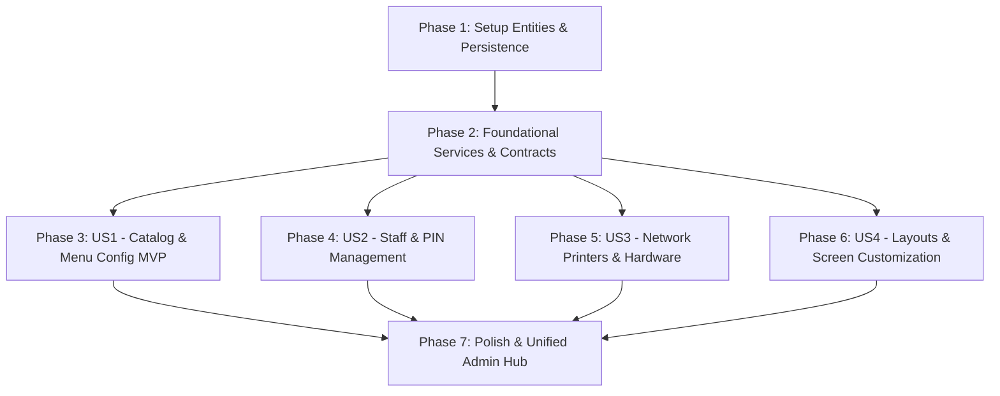

# Implementation Tasks: Configurable POS Management & Administration

**Feature**: `007-pos-configuration-management`  
**Specification**: [specs/007-pos-configuration-management/spec.md](spec.md)  
**Implementation Plan**: [specs/007-pos-configuration-management/plan.md](plan.md)  
**Status**: Completed  

---

## Phase 1: Setup (Domain Entities & Persistence Mapping)

**Purpose**: Define configuration domain entities and map them into EF Core contexts.

- [X] T001 [P] Enhance `ProductCategory` and `Product` domain entities in `src/RestaurantPos.Domain/Entities/Category.cs` and `src/RestaurantPos.Domain/Entities/Product.cs` with color codes, sort orders, icons, and station links
- [X] T002 [P] Define `PrinterConfiguration` and `TerminalLayoutProfile` domain entities in `src/RestaurantPos.Domain/Entities/PrinterConfiguration.cs` and `src/RestaurantPos.Domain/Entities/TerminalLayoutProfile.cs`
- [X] T003 [P] Update `AppDbContext` and `LocalAppDbContext` in `src/RestaurantPos.Infrastructure/Persistence/AppDbContext.cs` and `src/RestaurantPos.Client.Maui/Persistence/LocalAppDbContext.cs` to map `PrinterConfigurations` and `TerminalLayoutProfiles`

---

## Phase 2: Foundational (Application Service Contracts & Infrastructure Services)

**Purpose**: Core interfaces and business logic services required across all administration and configuration flows.

**⚠️ CRITICAL**: All user stories depend on these foundational components.

- [X] T004 [P] Define `IBackOfficeCatalogService`, `IStaffManagementService`, `IPrinterConfigurationService`, and `ITerminalLayoutService` in `src/RestaurantPos.Application/Common/Interfaces/IBackOfficeCatalogService.cs`, `src/RestaurantPos.Application/Common/Interfaces/IStaffManagementService.cs`, and `src/RestaurantPos.Application/Common/Interfaces/IPrinterAndLayoutServices.cs`
- [X] T005 Implement `BackOfficeCatalogService` in `src/RestaurantPos.Infrastructure/Services/BackOfficeCatalogService.cs` supporting category and article CRUD, soft archiving, and local Outbox event emission
- [X] T006 Implement `StaffManagementService` in `src/RestaurantPos.Infrastructure/Services/StaffManagementService.cs` with PIN format validation (4-6 digits), uniqueness verification, and salted SHA-256 hashing
- [X] T007 Implement `PrinterConfigurationService` in `src/RestaurantPos.Infrastructure/Services/PrinterConfigurationService.cs` and `TerminalLayoutService` in `src/RestaurantPos.Infrastructure/Services/TerminalLayoutService.cs` with TCP socket test print routine (`ESC @`, `GS V 66 0`)

**Checkpoint**: Foundation ready - all administrative backend services and contracts operational.

---

## Phase 3: User Story 1 - Menu & Catalog Configuration (Priority: P1) 🎯 MVP

**Goal**: Enable managers to create, edit, organize, and archive menu categories, articles, prices, and tax rate assignments with instant POS updates and zero historical receipt corruption.

**Independent Test**: Create category "Desserts" (#E67E22) $\to$ create article "Tiramisu" (7.50 €, 10% VAT, HotKitchen station). Open POS terminal $\to$ verify category and article appear immediately, and can be added to an active order with exact VAT breakdown.

### Tests for User Story 1

- [X] T008 [P] [US1] Create unit tests for category and product creation, pricing validation, tax bracket assignment, and soft-archiving in `tests/RestaurantPos.Infrastructure.Tests/BackOfficeCatalogServiceTests.cs`
- [X] T009 [P] [US1] Create unit tests for `CatalogAdminViewModel` in `tests/RestaurantPos.Client.Maui.Tests/CatalogAdminViewModelTests.cs`

### Implementation for User Story 1

- [X] T010 [US1] Implement `CatalogAdminViewModel` in `src/RestaurantPos.Client.Maui/ViewModels/CatalogAdminViewModel.cs` supporting category creation, color picking, article editing with numeric keypad integration, and reactive search filtering
- [X] T011 [US1] Implement tactile catalog management view in `src/RestaurantPos.Client.Maui/Views/CatalogAdminPage.xaml` and `src/RestaurantPos.Client.Maui/Views/CatalogAdminPage.xaml.cs`

**Checkpoint**: User Story 1 (Menu & Catalog Configuration) is fully functional and independently testable (MVP Ready).

---

## Phase 4: User Story 2 - Staff & Server Management with Secure PINs (Priority: P1)

**Goal**: Enable managers to add, update, and deactivate employees (Servers, Bartenders, Kitchen Cooks, Managers) with 4-6 digit salted PIN codes and role-based access control.

**Independent Test**: Register server "Lucas" with role "Server" and PIN "2468". Lock terminal. Enter PIN "2468" $\to$ unlocks terminal with server permissions. Attempt access to admin settings $\to$ prompts for manager PIN.

### Tests for User Story 2

- [X] T012 [P] [US2] Create unit tests for staff creation, PIN collision prevention, role authorization, and PIN reset in `tests/RestaurantPos.Infrastructure.Tests/StaffManagementServiceTests.cs`
- [X] T013 [P] [US2] Create unit tests for `StaffAdminViewModel` in `tests/RestaurantPos.Client.Maui.Tests/StaffAdminViewModelTests.cs`

### Implementation for User Story 2

- [X] T014 [US2] Implement `StaffAdminViewModel` in `src/RestaurantPos.Client.Maui/ViewModels/StaffAdminViewModel.cs` with PIN prompt, role assignment dropdown/selector, and active status toggle
- [X] T015 [US2] Implement tactile staff administration view in `src/RestaurantPos.Client.Maui/Views/StaffAdminPage.xaml` and `src/RestaurantPos.Client.Maui/Views/StaffAdminPage.xaml.cs`

**Checkpoint**: User Stories 1 AND 2 are complete and verified.

---

## Phase 5: User Story 3 - Network Printers & Production Station Hardware Setup (Priority: P2)

**Goal**: Enable discovering and declaring thermal network printers (IP/port 9100), assigning them production roles (Receipt/Drawer, Hot Kitchen, Cold Kitchen, Bar), and triggering diagnostic test prints.

**Independent Test**: Add printer "Imprimante Cuisine" at `192.168.1.150:9100` assigned to `HotKitchen`. Press "Test Print" $\to$ diagnostic slip is emitted. Place order with steak $\to$ ticket routes to that printer.

### Tests for User Story 3

- [X] T016 [P] [US3] Create integration tests for printer registration, station routing assignments, and diagnostic test print dispatch in `tests/RestaurantPos.Infrastructure.Tests/PrinterConfigurationServiceTests.cs`
- [X] T017 [P] [US3] Create unit tests for `PrinterAdminViewModel` in `tests/RestaurantPos.Client.Maui.Tests/PrinterAdminViewModelTests.cs`

### Implementation for User Story 3

- [X] T018 [US3] Implement `PrinterAdminViewModel` in `src/RestaurantPos.Client.Maui/ViewModels/PrinterAdminViewModel.cs` with mDNS scan trigger, IP/port form, station checkboxes, and test print invocation
- [X] T019 [US3] Implement tactile printer configuration modal and view in `src/RestaurantPos.Client.Maui/Views/PrinterAdminPage.xaml` and `src/RestaurantPos.Client.Maui/Views/PrinterAdminPage.xaml.cs`

**Checkpoint**: User Stories 1, 2, and 3 are complete and integrated.

---

## Phase 6: User Story 4 - Touch Terminal Screen & Layout Customization (Priority: P2)

**Goal**: Enable customizing category tab ordering, quick-key rush bar shortcuts, and grid column densities across different terminal profiles.

**Independent Test**: Create layout profile "Bar Terminal" placing "Boissons" first and pinning 4 cocktails to quick keys. Select profile on sales terminal $\to$ layout reflects new tab sequence and quick keys.

### Tests for User Story 4

- [X] T020 [P] [US4] Create unit tests for layout profile reordering, quick-key assignment, and station default settings in `tests/RestaurantPos.Infrastructure.Tests/TerminalLayoutServiceTests.cs`
- [X] T021 [P] [US4] Create unit tests for `LayoutAdminViewModel` in `tests/RestaurantPos.Client.Maui.Tests/LayoutAdminViewModelTests.cs`

### Implementation for User Story 4

- [X] T022 [US4] Implement `LayoutAdminViewModel` in `src/RestaurantPos.Client.Maui/ViewModels/LayoutAdminViewModel.cs` with category tab reordering, quick-keys picker, and column density configuration
- [X] T023 [US4] Implement tactile layout configuration view in `src/RestaurantPos.Client.Maui/Views/LayoutAdminPage.xaml` and `src/RestaurantPos.Client.Maui/Views/LayoutAdminPage.xaml.cs`

**Checkpoint**: All four user stories are complete, independently functional, and integrated.

---

## Phase 7: Polish & Cross-Cutting Concerns

**Purpose**: Unified administrative portal, build automation, performance benchmarks, and quality verification.

- [X] T024 [P] Implement unified administration hub navigation `AdminHubPage.xaml` and `AdminHubViewModel.cs` in `src/RestaurantPos.Client.Maui/Views/AdminHubPage.xaml` and `src/RestaurantPos.Client.Maui/ViewModels/AdminHubViewModel.cs`
- [X] T025 [P] Create automated PowerShell verification script in `scripts/powershell/verify-phase5-configuration.ps1`
- [X] T026 Execute full quickstart verification scenarios per `specs/007-pos-configuration-management/quickstart.md`
- [X] T027 Roslyn warning cleanup and code documentation updates across configuration modules

---

## Dependencies & Execution Order

### Phase Dependencies

---

## Implementation Strategy

### MVP First (User Story 1 Only)
1. Complete Phase 1 (Setup) and Phase 2 (Foundational Services).
2. Complete Phase 3 (User Story 1: Catalog & Menu Configuration).
3. **Validate**: Test category and product creation, price/tax assignment, and instant sales terminal visibility.

### Incremental Delivery
1. Deliver US1 (Catalog) $\to$ Full menu configurability.
2. Deliver US2 (Staff) $\to$ Multi-operator fast PIN login & role security.
3. Deliver US3 (Printers) $\to$ Kitchen ticket & receipt routing.
4. Deliver US4 (Layouts) $\to$ Tactile screen tailoring per workstation.
5. Deliver Polish $\to$ Unified Admin Hub and regression test suite.
