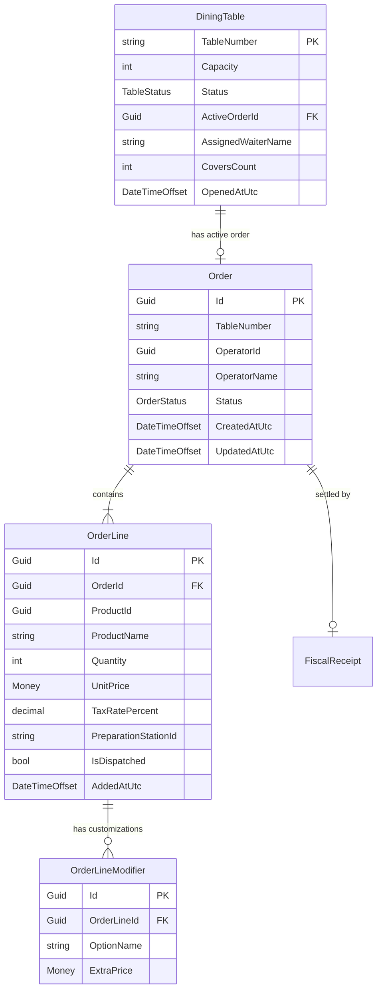
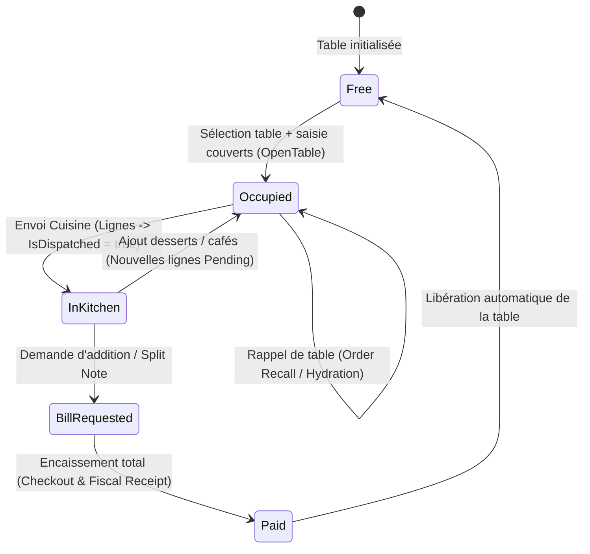

# Data Model & State Transitions: Table Order Recall & Cart Hydration

**Feature**: `008-table-order-recall`  
**Date**: 2026-08-30  

---

## 1. Modèle Conceptuel & Relations



---

## 2. Machine à États du Panier & Cycle de Vie d'une Table



---

## 3. DTOs d'Échange de Données

```csharp
public record ActiveTableOrderDto(
    Guid OrderId,
    string TableNumber,
    string? WaiterName,
    int CoversCount,
    DateTimeOffset OpenedAtUtc,
    IReadOnlyList<ActiveOrderLineDto> Lines,
    decimal TotalHtAmount,
    decimal TotalVatAmount,
    decimal TotalTtcAmount
);

public record ActiveOrderLineDto(
    Guid LineId,
    Guid ProductId,
    string ProductName,
    int Quantity,
    decimal UnitPrice,
    decimal TotalPrice,
    decimal TaxRatePercent,
    string? PreparationStationId,
    bool IsDispatched,
    IReadOnlyList<string> ModifiersSummary
);
```
