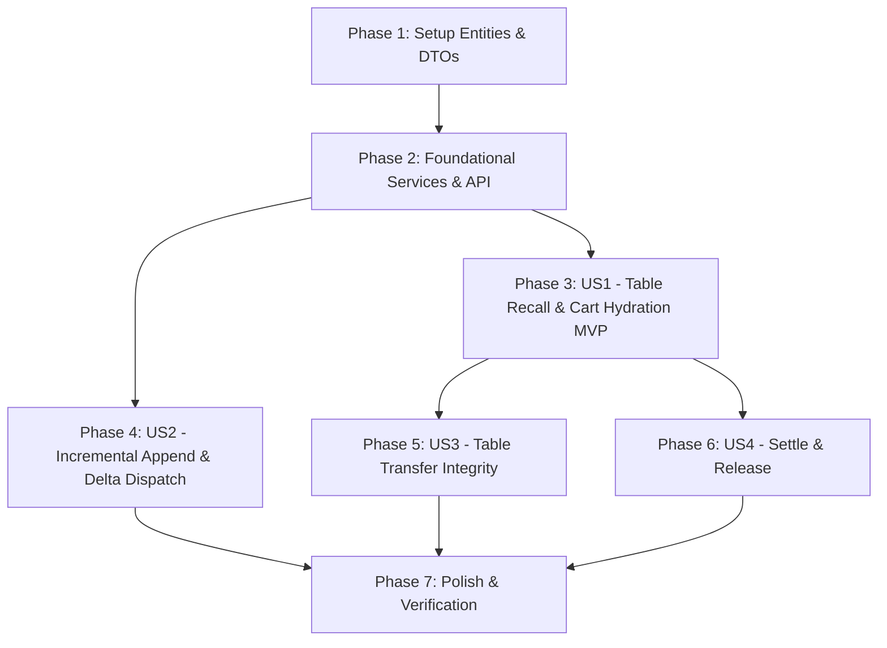

# Implementation Tasks: Rappel & Restauration du Contenu de Table (Table Order Recall & Cart Hydration)

**Feature**: `008-table-order-recall`  
**Specification**: [specs/008-table-order-recall/spec.md](spec.md)  
**Implementation Plan**: [specs/008-table-order-recall/plan.md](plan.md)  
**Status**: Ready for Implementation  

---

## Phase 1: Setup (Domain Entities & DTOs)

**Purpose**: Définir les modèles et structures de données pour l'association table-commande et les DTOs d'hydratation.

- [X] T001 [P] Ensure `Order` and `OrderLine` in `src/RestaurantPos.Domain/Entities/Order.cs` include `IsDispatched` boolean and station indicators
- [X] T002 [P] Define `ActiveTableOrderDto` and `ActiveOrderLineDto` in `src/RestaurantPos.Application/Common/Interfaces/ITableManagementService.cs`
- [X] T003 [P] Verify EF Core mappings in `src/RestaurantPos.Infrastructure/Persistence/AppDbContext.cs` and `src/RestaurantPos.Client.Maui/Persistence/LocalAppDbContext.cs` for eager loading of `Order.Lines`

---

## Phase 2: Foundational (Application Service Contracts & Persistence Logic)

**Purpose**: Core interfaces and business logic services required across all table recall and order hydration flows.

**⚠️ CRITICAL**: All user stories depend on these foundational components.

- [X] T004 [P] Update `ITableManagementService` interface in `src/RestaurantPos.Application/Common/Interfaces/ITableManagementService.cs` with `GetActiveOrderForTableAsync(string tableNumber, CancellationToken ct)`
- [X] T005 Implement `GetActiveOrderForTableAsync` in `src/RestaurantPos.Infrastructure/Services/TableManagementService.cs` retrieving the active order with all lines, item quantities, and tax calculations
- [X] T006 Implement REST API endpoint `GET /api/tables/{tableNumber}/order` in `src/RestaurantPos.Api/Program.cs` returning `ActiveTableOrderDto`
- [X] T007 Implement REST API endpoint `POST /api/tables/{tableNumber}/items` in `src/RestaurantPos.Api/Program.cs` for persisting added articles to active table orders

**Checkpoint**: Foundation ready - table orders can be queried and updated via API and local service.

---

## Phase 3: User Story 1 - Table Recall & Cart Hydration (Priority: P1) 🎯 MVP

**Goal**: When a waiter or cashier selects an occupied table from the 2D floor plan or enters a table number, the sales cart immediately loads all existing ordered items with quantities, prices, VAT breakdown, and table metadata.

**Independent Test**: Open table `T2` with 3 covers $\to$ add 2 Salades César & 1 Burger $\to$ switch to floor plan $\to$ click table `T1` then re-click `T2`. POS cart instantly restores the 3 items, 38.50 € TTC total, VAT breakdown, and Table T2 badge.

### Tests for User Story 1

- [X] T008 [P] [US1] Create unit tests for `GetActiveOrderForTableAsync` with populated and empty tables in `tests/RestaurantPos.Infrastructure.Tests/TableManagementServiceTests.cs`
- [X] T009 [P] [US1] Create unit tests for table selection and cart hydration in `tests/RestaurantPos.Client.Maui.Tests/PosTerminalViewModelTests.cs`

### Implementation for User Story 1

- [X] T010 [US1] Implement cart hydration method `LoadActiveTableOrderAsync` in `src/RestaurantPos.Client.Maui/ViewModels/PosTerminalViewModel.cs`
- [X] T011 [US1] Bind table selection events in `src/RestaurantPos.Client.Maui/ViewModels/FloorPlanViewModel.cs` to trigger cart hydration
- [X] T012 [US1] Implement asynchronous table recall and cart population in `src/RestaurantPos.Api/wwwroot/app.js` when clicking a table in the 2D floor plan

**Checkpoint**: User Story 1 (Table Recall MVP) is fully functional and independently testable.

---

## Phase 4: User Story 2 - Incremental Order Append & Delta Kitchen Dispatch (Priority: P1)

**Goal**: Enable adding new courses (desserts, drinks) to a recalled table and dispatching only the newly added items to kitchen/bar stations without re-sending already prepared items.

**Independent Test**: Recall `T2` with existing main courses $\to$ add 2 Tiramisus $\to$ click "Envoyer Cuisine" $\to$ KDS receives only the Dessert ticket, and lines are marked as dispatched.

### Tests for User Story 2

- [X] T013 [P] [US2] Create unit tests for delta kitchen dispatch (dispatching only `IsDispatched == false` items) in `tests/RestaurantPos.Infrastructure.Tests/KitchenRoutingServiceTests.cs`
- [X] T014 [P] [US2] Create unit tests for incremental cart additions on recalled tables in `tests/RestaurantPos.Client.Maui.Tests/PosTerminalViewModelTests.cs`

### Implementation for User Story 2

- [X] T015 [US2] Update `KitchenRoutingService.cs` in `src/RestaurantPos.Infrastructure/Services/KitchenRoutingService.cs` to filter and route only undispatched lines
- [X] T016 [US2] Implement delta kitchen dispatch endpoint `POST /api/tables/{tableNumber}/dispatch` in `src/RestaurantPos.Api/Program.cs`
- [X] T017 [US2] Update UI in `src/RestaurantPos.Api/wwwroot/app.js` and `src/RestaurantPos.Api/wwwroot/styles.css` to visually distinguish dispatched items ("En Cuisine") from pending additions

**Checkpoint**: User Stories 1 AND 2 are complete and verified.

---

## Phase 5: User Story 3 - Table Transfer & Fusion with Order Integrity (Priority: P2)

**Goal**: When guests move tables, transferring the table preserves all order lines and updates the active order pointer so recalling the new table shows the full order.

**Independent Test**: Transfer table `T2` to `T5` $\to$ recall `T5` $\to$ cart displays the 38.50 € order, and `T2` becomes free.

### Tests for User Story 3

- [X] T018 [P] [US3] Create unit tests for table transfer preserving order lines and resetting source table in `tests/RestaurantPos.Infrastructure.Tests/TableManagementServiceTests.cs`
- [X] T019 [P] [US3] Create integration tests for table transfer in `tests/RestaurantPos.Client.Maui.Tests/FloorPlanViewModelTests.cs`

### Implementation for User Story 3

- [X] T020 [US3] Ensure `TransferTableAsync` in `src/RestaurantPos.Infrastructure/Services/TableManagementService.cs` updates `Order.TableNumber` and transfers `ActiveOrderId` atomically
- [X] T021 [US3] Implement transfer UI and state refresh in `src/RestaurantPos.Api/wwwroot/app.js`

**Checkpoint**: User Stories 1, 2, and 3 are complete and integrated.

---

## Phase 6: User Story 4 - Recall for Settle/Split Bill & Table Release (Priority: P2)

**Goal**: When recalling a table for checkout, accurately load the remaining balance, execute payment or split bill, and free the table upon full settlement.

**Independent Test**: Recall table `T2` $\to$ click "Encaisser" $\to$ pay full balance $\to$ table `T2` becomes `Free` and cart resets.

### Tests for User Story 4

- [X] T022 [P] [US4] Create unit tests for table settlement closing active order and freeing table in `tests/RestaurantPos.Infrastructure.Tests/CheckoutPaymentServiceTests.cs`
- [X] T023 [P] [US4] Create unit tests for checkout viewmodel on recalled tables in `tests/RestaurantPos.Client.Maui.Tests/CheckoutViewModelTests.cs`

### Implementation for User Story 4

- [X] T024 [US4] Update checkout settlement in `src/RestaurantPos.Infrastructure/Services/CheckoutPaymentService.cs` to clear `DiningTable.ActiveOrderId` and set `Status = Free`
- [X] T025 [US4] Update `src/RestaurantPos.Api/wwwroot/app.js` to refresh floor plan and clear cart upon successful payment

**Checkpoint**: All four user stories are complete, independently functional, and integrated.

---

## Phase 7: Polish & Automated Verification

**Purpose**: Build validation, regression testing, and verification scripts.

- [X] T026 [P] Create automated PowerShell verification script in `scripts/powershell/verify-phase6-table-recall.ps1`
- [X] T027 Execute full test suite (`dotnet test`) across all projects to ensure 100% pass rate and 0 warnings

---

## Dependencies & Execution Order

---

## Implementation Strategy

### MVP First (User Story 1 Only)
1. Complete Phase 1 (Setup) and Phase 2 (Foundational Services).
2. Implement User Story 1 (Table Recall & Cart Hydration).
3. **Validate MVP**: Click on table `T2` $\to$ verify all ordered items appear in the sales cart immediately with correct total.

### Incremental Delivery
1. Deliver US1 (Recall MVP) $\to$ Instant cart hydration.
2. Deliver US2 (Delta Dispatch) $\to$ Multi-course service without duplicate tickets.
3. Deliver US3 (Transfer) $\to$ Seamless table changes.
4. Deliver US4 (Checkout & Release) $\to$ Complete lifecycle.
5. Finalize Polish $\to$ Run automated test script.
