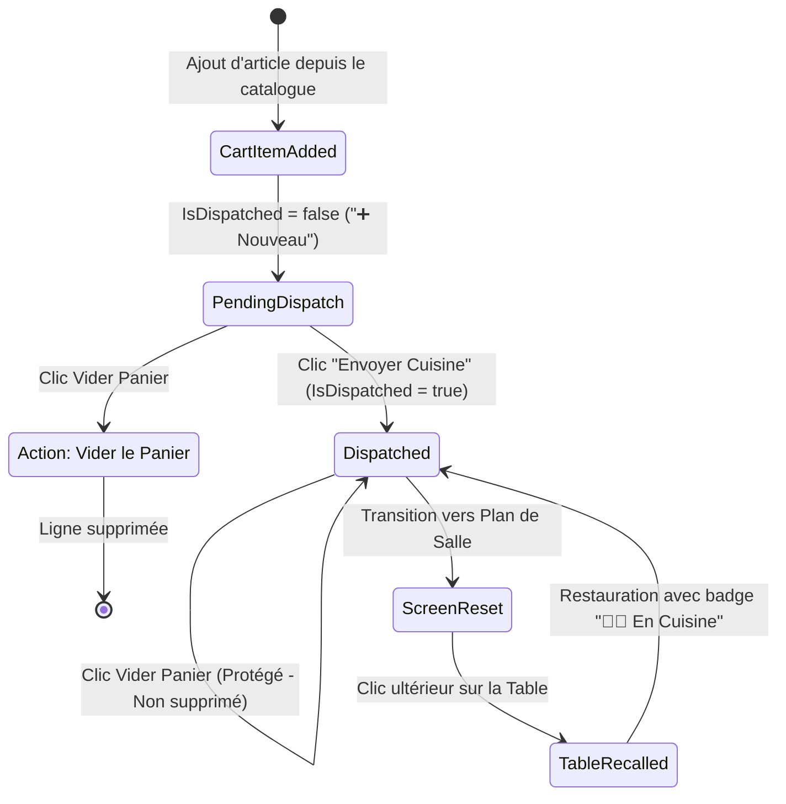

# Phase 1 Data Model: Règles de Vidage du Panier et Réinitialisation post-Envoi Cuisine

**Feature**: `009-table-cart-rules`  
**Date**: 2026-08-30

---

## 1. Modèle d'État du Panier & Statuts de Ligne



---

## 2. Structure des Objets de Panier (Client Side)

### Entité `CartItemState`
```typescript
export interface CartItemState {
  lineId?: string;
  product: {
    id: string;
    name: string;
    price: number;
    taxRatePercent: number;
    preparationStationId: string;
  };
  quantity: number;
  isDispatched: boolean; // TRUE = Déjà en cuisine (protégé), FALSE = Nouveau (vidable)
  modifiers: string[];
}
```

### Entité `TableOrderSession`
```typescript
export interface TableOrderSession {
  activeTable: string; // Ex: "T2", "T6"
  activeOrderId: string | null;
  activeCovers: number;
  cart: CartItemState[];
  totalHt: number;
  totalVat: number;
  totalTtc: number;
}
```

---

## 3. Matrice de Comportement du Bouton "Vider le Panier"

| État du Panier | Action « Vider le panier » | Résultat Visuel & Données | Toast / Feedback |
|---|---|---|---|
| **Panier vide** | Clic | Aucune action | Aucun |
| **Uniquement des articles `isDispatched == false`** | Clic | Panier vidé à 100% | `Panier vidé` (Info) |
| **Mélange d'articles `isDispatched == true` et `false`** | Clic | Seuls les articles `false` sont supprimés. Les articles `true` restent affichés avec totaux recalculés | `X nouveaux articles retirés. Les articles en cuisine sont conservés.` (Info) |
| **Uniquement des articles `isDispatched == true`** | Clic | 0 article supprimé. Le panier reste intact. | `Les articles déjà en cuisine ne peuvent pas être vidés.` (Erreur/Avertissement) |
