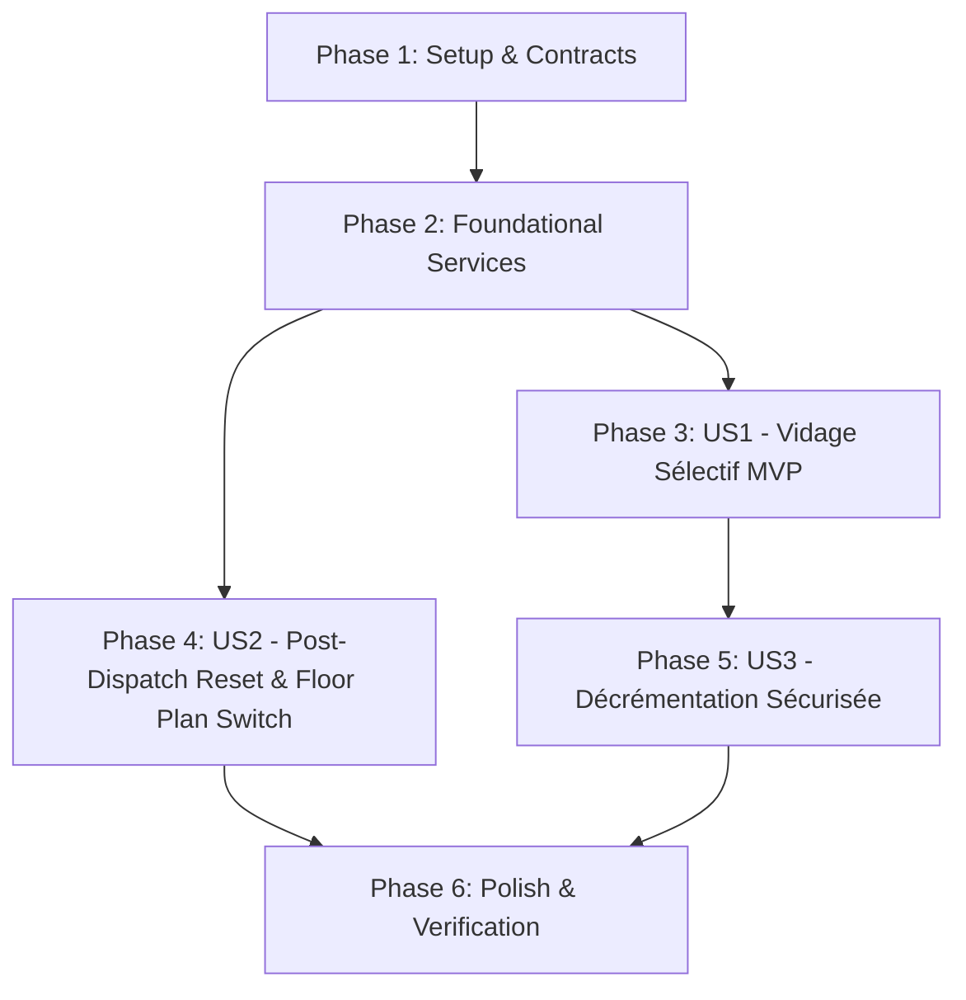

# Implementation Tasks: Règles de Vidage du Panier et Réinitialisation post-Envoi Cuisine

**Feature**: `009-table-cart-rules`  
**Specification**: [specs/009-table-cart-rules/spec.md](spec.md)  
**Implementation Plan**: [specs/009-table-cart-rules/plan.md](plan.md)  
**Status**: Ready for Implementation  

---

## Phase 1: Setup (Data Models & Contracts)

**Purpose**: S'assurer que les modèles de données et contrats DTO exposent les indicateurs nécessaires pour la distinction des lignes envoyées en cuisine.

- [X] T001 [P] Verify `OrderItem.IsDispatched` boolean and preparation station indicator in `src/RestaurantPos.Domain/Entities/Order.cs`
- [X] T002 [P] Verify `ActiveOrderLineDto.IsDispatched` in `src/RestaurantPos.Application/Common/Interfaces/ITableManagementService.cs`

---

## Phase 2: Foundational (Backend Services & Dispatch Endpoints)

**Purpose**: Valider et consolider les méthodes de persistance incrémentale et de dispatching delta.

- [X] T003 [P] Ensure `TableManagementService.cs` in `src/RestaurantPos.Infrastructure/Services/TableManagementService.cs` supports fetching active order lines with `IsDispatched` status and updating newly added lines
- [X] T004 [P] Ensure `POST /api/tables/{tableNumber}/items` and `POST /api/tables/{tableNumber}/dispatch` in `src/RestaurantPos.Api/Program.cs` persist new lines and generate KDS tickets atomically

**Checkpoint**: Backend prêt pour le traitement des règles de panier et de dispatching.

---

## Phase 3: User Story 1 - Vidage Sélectif du Panier de Table (Priority: P1) 🎯 MVP

**Goal**: Permettre au bouton « Vider le panier » de purger exclusivement les articles en attente d'envoi (`IsDispatched == false`) tout en conservant les articles déjà envoyés en cuisine (`IsDispatched == true`).

**Independent Test**: Ouvrir la Table `T2` (avec 2 Salades et 1 Burger en cuisine) $\to$ ajouter 2 Tiramisus $\to$ cliquer sur « Vider le panier » $\to$ seuls les 2 Tiramisus sont retirés, les Salades et le Burger restent avec le total de 38.50 €, et un message d'information s'affiche.

### Tests for User Story 1

- [X] T005 [P] [US1] Create unit tests for selective cart clear protecting dispatched items in `tests/RestaurantPos.Client.Maui.Tests/PosTerminalViewModelTests.cs`

### Implementation for User Story 1

- [X] T006 [US1] Implement `ClearCart` logic in `src/RestaurantPos.Client.Maui/ViewModels/PosTerminalViewModel.cs` (purging only `IsDispatched == false` items, preserving dispatched items, and recalculating totals)
- [X] T007 [US1] Implement selective cart clear in `src/RestaurantPos.Api/wwwroot/app.js` with toast feedback (`"X nouveaux articles retirés. Les articles en cuisine sont conservés."` / `"Les articles déjà en cuisine ne peuvent pas être vidés."`)
- [X] T008 [US1] Ensure cart line styling in `src/RestaurantPos.Api/wwwroot/styles.css` clearly highlights dispatched vs pending items

**Checkpoint**: User Story 1 (Selective Cart Clear) fonctionnel et testable indépendamment.

---

## Phase 4: User Story 2 - Réinitialisation et Transition d'Écran Post-Envoi Cuisine (Priority: P1)

**Goal**: Lors de l'appui sur « Envoyer Cuisine », enregistrer et dispatcher les nouveaux articles, vider le panier actif et basculer automatiquement sur la vue du plan de salle pour enchaîner le service.

**Independent Test**: Sur la Table `T2`, ajouter 1 dessert $\to$ cliquer sur « Envoyer Cuisine » $\to$ le panier se vide, l'application bascule automatiquement sur la vue Plan de Salle avec un toast vert de succès.

### Tests for User Story 2

- [X] T009 [P] [US2] Create unit tests for post-dispatch cart reset and table release/navigation in `tests/RestaurantPos.Client.Maui.Tests/PosTerminalViewModelTests.cs`

### Implementation for User Story 2

- [X] T010 [US2] Implement post-dispatch cart reset and navigation in `src/RestaurantPos.Client.Maui/ViewModels/PosTerminalViewModel.cs`
- [X] T011 [US2] Implement `btnSendKitchen` handler in `src/RestaurantPos.Api/wwwroot/app.js` to persist new items, dispatch KDS tickets, reset local cart session, and trigger `switchView('floorPlanView')`
- [X] T012 [US2] Refresh KDS and Floor Plan state in `src/RestaurantPos.Api/wwwroot/app.js` upon kitchen dispatch

**Checkpoint**: User Stories 1 et 2 complètes et intégrées.

---

## Phase 5: User Story 3 - Gestion des Lignes Individuelles Non Envoyées (Priority: P2)

**Goal**: Permettre la diminution ou la suppression d'un article non envoyé via les contrôles `[-]` sans autoriser la réduction en-dessous de la quantité déjà en cuisine.

**Independent Test**: Sur un article commandé à 2 unités en cuisine + 1 nouvelle unité, cliquer sur `[-]` réduit la quantité à 2 mais ne permet pas de descendre à 1.

### Tests for User Story 3

- [X] T013 [P] [US3] Create unit tests for item decrement and removal on mixed dispatched lines in `tests/RestaurantPos.Client.Maui.Tests/PosTerminalViewModelTests.cs`

### Implementation for User Story 3

- [X] T014 [US3] Implement quantity decrement guards in `src/RestaurantPos.Client.Maui/ViewModels/PosTerminalViewModel.cs`
- [X] T015 [US3] Implement quantity decrement controls and protections in `src/RestaurantPos.Api/wwwroot/app.js`

**Checkpoint**: Toutes les règles de manipulation de panier sont sécurisées.

---

## Phase 6: Polish & Automated Verification

**Purpose**: Script de validation automatisé et exécution complète des tests.

- [X] T016 [P] Create automated PowerShell verification script `scripts/powershell/verify-phase7-cart-rules.ps1`
- [X] T017 Execute full test suite (`dotnet test`) across all projects with 0 errors and 0 warnings

---

## Dependencies & Execution Order

---

## Implementation Strategy

### MVP First (User Story 1 & 2)
1. Valider Phase 1 & 2 (Contrats et Backend).
2. Implémenter US1 (Vidage sélectif préservant les plats en cuisine).
3. Implémenter US2 (Bascule automatique sur le plan de salle après envoi cuisine).
4. Exécuter le script de validation `verify-phase7-cart-rules.ps1`.
