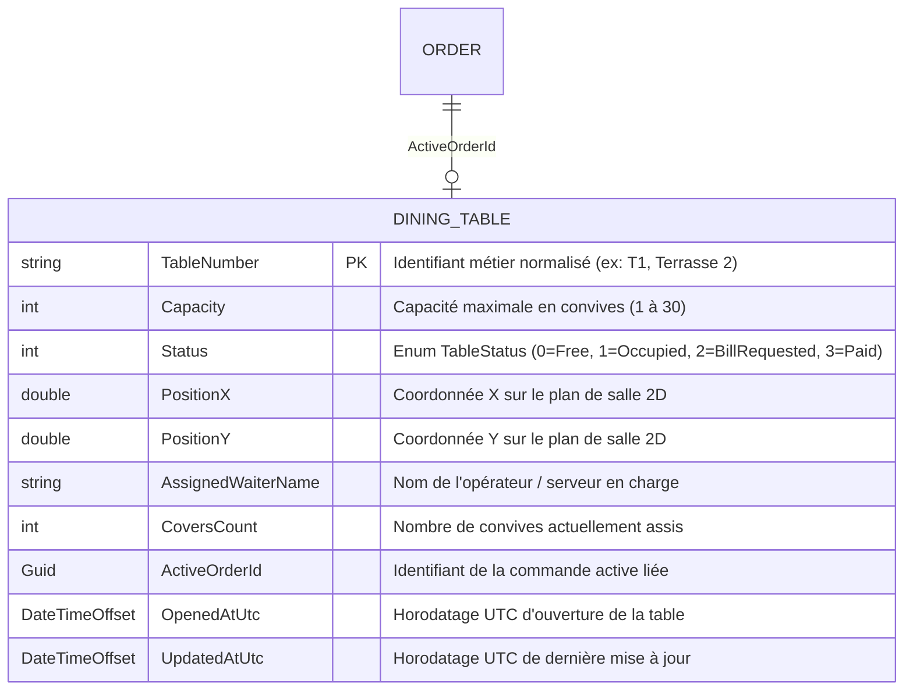

# Phase 1 Data Model: Création Directe de Table depuis la Vue Tables

**Feature**: `010-create-table-floorplan`  
**Date**: 2026-08-30

---

## 1. Modèle Entité `DiningTable`



---

## 2. Contrats de Données (DTOs)

### DTO d'Entrée : `CreateTableRequest`
```csharp
public record CreateTableRequest(
    string TableNumber,
    int Capacity,
    double? PositionX,
    double? PositionY
);
```

### DTO de Sortie : `DiningTableDto`
```csharp
public record DiningTableDto(
    string TableNumber,
    int Capacity,
    TableStatus Status,
    double PositionX,
    double PositionY,
    string? AssignedWaiterName,
    int CoversCount,
    Guid? ActiveOrderId,
    DateTimeOffset? OpenedAtUtc
);
```

---

## 3. Règles de Validation

1. **TableNumber** : Requis, non vide, 1 à 32 caractères, normalisé en majuscules sans espaces de début/fin.
2. **Capacity** : Entier positif entre 1 et 30 couverts (défaut = 2 si non spécifié ou $\le 0$).
3. **Status initial** : Toujours initialisé à `TableStatus.Free` (0).
