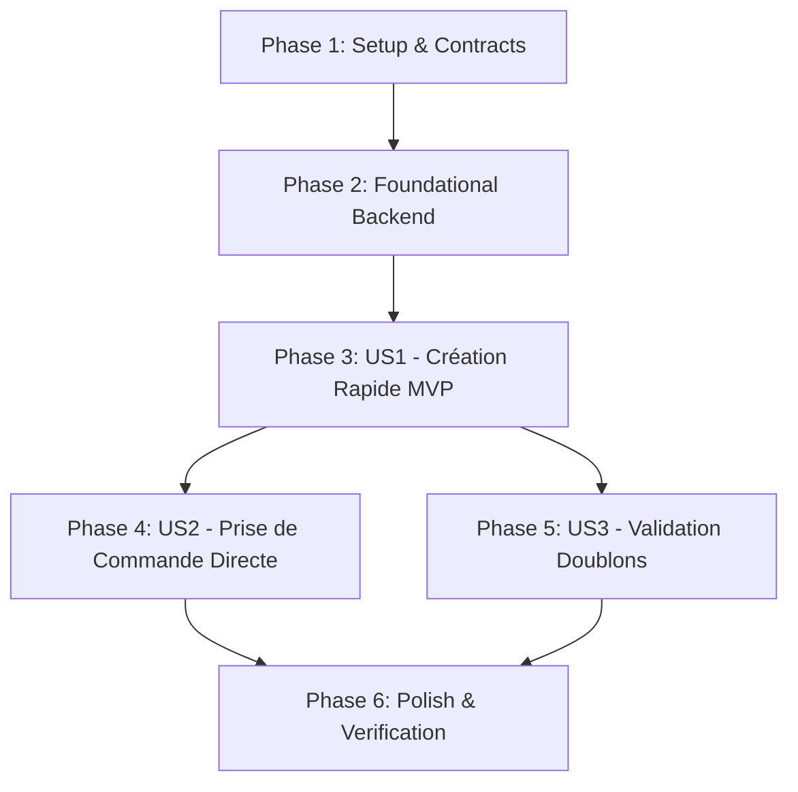

# Implementation Tasks: Création Directe de Table depuis la Vue Tables

**Feature**: `010-create-table-floorplan`  
**Specification**: [specs/010-create-table-floorplan/spec.md](spec.md)  
**Implementation Plan**: [specs/010-create-table-floorplan/plan.md](plan.md)  
**Status**: Ready for Implementation  

---

## Phase 1: Setup (Contracts & DTOs)

**Purpose**: Définir les contrats de données pour la création et la transmission de nouvelles tables.

- [X] T001 [P] Add `CreateTableAsync` method signature to `src/RestaurantPos.Application/Common/Interfaces/ITableManagementService.cs`
- [X] T002 [P] Define `CreateTableRequest` DTO and API request records in `src/RestaurantPos.Api/Program.cs`

---

## Phase 2: Foundational (Backend Service & API Endpoint)

**Purpose**: Implémenter la logique de création de table dans le service d'infrastructure et exposer le point d'accès REST.

- [X] T003 [P] Implement `CreateTableAsync` in `src/RestaurantPos.Infrastructure/Services/TableManagementService.cs` with uppercase normalization, capacity defaults, and free status initialization
- [X] T004 [P] Expose `POST /api/tables` endpoint in `src/RestaurantPos.Api/Program.cs` with model validation and HTTP 201 response

**Checkpoint**: Le backend et l'API permettent d'ajouter une nouvelle table de façon persistante.

---

## Phase 3: User Story 1 - Création Rapide d'une Nouvelle Table depuis le Plan de Salle (Priority: P1) 🎯 MVP

**Goal**: Permettre aux serveurs d'ajouter une table directement depuis la vue 2D du plan de salle via un bouton `➕ Nouvelle Table` et une modale ergonomique.

**Independent Test**: Ouvrir le plan de salle $\to$ cliquer sur `➕ Nouvelle Table` $\to$ entrer `T9` (4 places) $\to$ valider $\to$ la table `T9` apparaît immédiatement au statut `Libre`.

### Tests for User Story 1

- [X] T005 [P] [US1] Create unit tests for `CreateTableAsync` verifying database persistence and property mapping in `tests/RestaurantPos.Infrastructure.Tests/TableManagementServiceTests.cs`

### Implementation for User Story 1

- [X] T006 [US1] Add `➕ Nouvelle Table` button in the Floor Plan view header in `src/RestaurantPos.Api/wwwroot/index.html`
- [X] T007 [US1] Create `#addTableModal` with table number input, quick capacity buttons (2p, 4p, 6p, 8p), and confirm/cancel controls in `src/RestaurantPos.Api/wwwroot/index.html`
- [X] T008 [US1] Add CSS styles for `.btn-cap-quick` and `#addTableModal` in `src/RestaurantPos.Api/wwwroot/styles.css`
- [X] T009 [US1] Implement modal open/close and `formAddNewTable` submit handler in `src/RestaurantPos.Api/wwwroot/app.js` with instant `loadFloorPlanData()` refresh

**Checkpoint**: User Story 1 (Création rapide de table) fonctionnelle et testable indépendamment.

---

## Phase 4: User Story 2 - Prise de Commande Immédiate sur la Table Créée (Priority: P1)

**Goal**: Dès qu'une table est créée, pouvoir cliquer dessus pour l'ouvrir et basculer directement dans le terminal de vente.

**Independent Test**: Cliquer sur la nouvelle carte `T9` $\to$ saisir les couverts $\to$ l'écran de caisse s'ouvre avec le badge `Table T9`.

### Implementation for User Story 2

- [X] T010 [US2] Implement table click interaction on dynamically added table cards in `src/RestaurantPos.Api/wwwroot/app.js`
- [X] T011 [US2] Add `AddTableAsync` command with haptic feedback in `src/RestaurantPos.Client.Maui/ViewModels/FloorPlanViewModel.cs`

**Checkpoint**: Prise de commande fluide et continue dès la création de table.

---

## Phase 5: User Story 3 - Prévention des Doublons et Validation des Capacités (Priority: P2)

**Goal**: Empêcher la création de tables portant un nom déjà existant et contrôler la validité des plages de capacité.

**Independent Test**: Tenter de créer une table `T2` (existante) $\to$ le système avertit l'utilisateur et refuse la duplication.

### Tests for User Story 3

- [X] T012 [P] [US3] Create unit tests for duplicate table handling in `tests/RestaurantPos.Infrastructure.Tests/TableManagementServiceTests.cs`

### Implementation for User Story 3

- [X] T013 [US3] Add duplicate detection and error feedback in `src/RestaurantPos.Infrastructure/Services/TableManagementService.cs` and `src/RestaurantPos.Api/wwwroot/app.js`

**Checkpoint**: Intégrité des noms de tables garantie.

---

## Phase 6: Polish & Automated Verification

**Purpose**: Valider l'ensemble du flux de création de table et exécuter les tests de non-régression.

- [X] T014 [P] Update validation script `scripts/powershell/verify-phase7-cart-rules.ps1` with live table creation assertions
- [X] T015 Execute full test suite (`dotnet test`) across all projects with 0 errors and 0 warnings

---

## Dependencies & Execution Order

---

## Implementation Strategy

### MVP First (User Story 1 & 2)
1. Exposer le contrat et le service de création de table.
2. Intégrer le bouton et la modale tactile sur le plan de salle.
3. Permettre la transition directe vers la prise de commande.
4. Valider l'ensemble avec le script automatisé.
