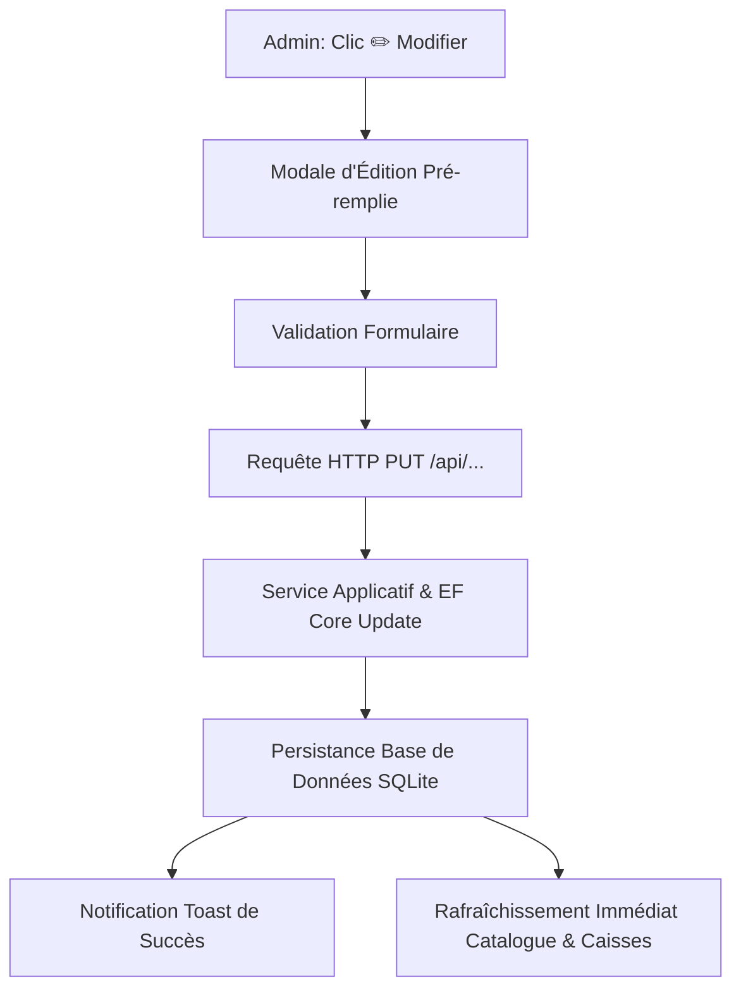

# Phase 1 Data Model: Modification des Objets dans le Module de Configuration

**Feature**: `011-edit-configuration-objects`  
**Date**: 2026-08-31

---

## 1. DTOs de Mise à Jour (Request Records)

### `UpdateProductRequest`
```csharp
public record UpdateProductRequest(
    string Name,
    string CategoryId,
    decimal Price,
    decimal TaxRatePercent,
    string? Description,
    string? ColorHex,
    int DisplayOrder,
    bool IsQuickKey,
    string? StationId
);
```

### `UpdateCategoryRequest`
```csharp
public record UpdateCategoryRequest(
    string Name,
    string? ColorHex,
    int DisplayOrder,
    string? IconName
);
```

### `UpdateStaffRequest`
```csharp
public record UpdateStaffRequest(
    string Name,
    string Role,
    string? Pin, // Si non nul, réinitialise le code PIN
    bool IsActive
);
```

### `UpdatePrinterRequest`
```csharp
public record UpdatePrinterRequest(
    string Name,
    string IpAddress,
    int Port,
    int PaperWidthMm,
    bool HasCashDrawer,
    List<string> TargetStations
);
```

---

## 2. Diagramme d'Impact des Mises à Jour


