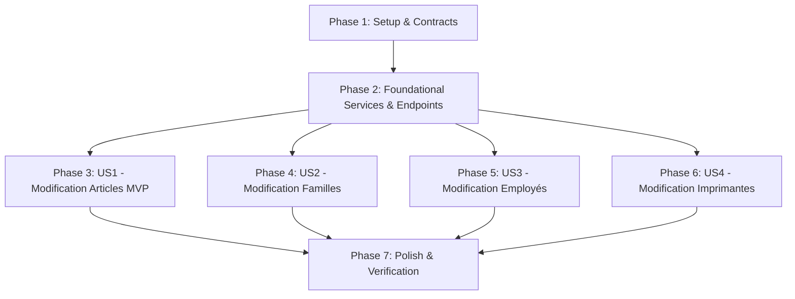

# Implementation Tasks: Modification des Objets dans le Module de Configuration

**Feature**: `011-edit-configuration-objects`  
**Specification**: [specs/011-edit-configuration-objects/spec.md](spec.md)  
**Implementation Plan**: [specs/011-edit-configuration-objects/plan.md](plan.md)  
**Status**: Completed  

---

## Phase 1: Setup (Contracts & DTOs)

**Purpose**: Définir les DTOs de requête et enrichir les interfaces de services d'application.

- [X] T001 [P] Define `UpdateProductRequest`, `UpdateCategoryRequest`, `UpdateStaffRequest`, `UpdatePrinterRequest` records in `src/RestaurantPos.Api/Program.cs`
- [X] T002 [P] Add update method signatures to `ICatalogManagementService`, `IStaffManagementService`, `IPrinterRoutingService` in `src/RestaurantPos.Application/Common/Interfaces/`

---

## Phase 2: Foundational (Backend Services & REST Endpoints)

**Purpose**: Implémenter la logique de mise à jour dans les services d'infrastructure et exposer les endpoints `PUT`.

- [X] T003 [P] Implement `UpdateProductAsync` and `UpdateCategoryAsync` in `src/RestaurantPos.Infrastructure/Services/CatalogManagementService.cs`
- [X] T004 [P] Implement `UpdateStaffAsync` in `src/RestaurantPos.Infrastructure/Services/StaffManagementService.cs` (avec contrôle d'unicité et chiffrement SHA-256 du code PIN si fourni)
- [X] T005 [P] Implement `UpdatePrinterAsync` in `src/RestaurantPos.Infrastructure/Services/PrinterRoutingService.cs`
- [X] T006 [P] Expose endpoints `PUT /api/products/{id}`, `PUT /api/categories/{id}`, `PUT /api/staff/{id}`, `PUT /api/printers/{id}` in `src/RestaurantPos.Api/Program.cs`

**Checkpoint**: Tous les endpoints REST `PUT` sont opérationnels et testables via HTTP.

---

## Phase 3: User Story 1 - Modification des Articles et Produits du Catalogue (Priority: P1) 🎯 MVP

**Goal**: Permettre aux gérants de modifier les caractéristiques d'un article existant (nom, prix, famille, TVA, poste KDS, touche rapide).

**Independent Test**: Modifier le prix du « Burger Maison » de 16.50 € à 17.50 € $\to$ le catalogue d'administration et la grille de vente tactile affichent immédiatement 17.50 €.

### Tests for User Story 1

- [X] T007 [P] [US1] Create unit tests for product updating in `tests/RestaurantPos.Infrastructure.Tests/CatalogManagementServiceTests.cs`

### Implementation for User Story 1

- [X] T008 [US1] Add `editProductModal` markup and `✏️ Modifier` action button on product cards in `src/RestaurantPos.Api/wwwroot/index.html`
- [X] T009 [US1] Implement product editing handler in `src/RestaurantPos.Api/wwwroot/app.js` with instant catalog and POS terminal refresh

**Checkpoint**: User Story 1 (Modification des articles) fonctionnelle et testable indépendamment.

---

## Phase 4: User Story 2 - Modification des Familles / Catégories (Priority: P1)

**Goal**: Permettre de modifier le nom et la couleur d'une famille d'articles avec mise à jour immédiate des onglets de caisse.

**Independent Test**: Modifier le nom de la famille « Plats » en « Plats & Grillades » et changer la couleur $\to$ les onglets de caisse se synchronisent immédiatement.

### Tests for User Story 2

- [X] T010 [P] [US2] Create unit tests for category updating in `tests/RestaurantPos.Infrastructure.Tests/CatalogManagementServiceTests.cs`

### Implementation for User Story 2

- [X] T011 [US2] Add `editCategoryModal` markup and edit trigger on category elements in `src/RestaurantPos.Api/wwwroot/index.html`
- [X] T012 [US2] Implement category update handler in `src/RestaurantPos.Api/wwwroot/app.js` with instant category tabs refresh

**Checkpoint**: User Story 2 (Modification des familles) complète.

---

## Phase 5: User Story 3 - Modification des Employés et Codes PIN (Priority: P1)

**Goal**: Permettre de modifier le nom, le rôle et le code PIN d'un employé existant.

**Independent Test**: Modifier le PIN d'Alexandre en `5555` $\to$ déverrouiller la caisse avec `5555`.

### Tests for User Story 3

- [X] T013 [P] [US3] Create unit tests for staff updating in `tests/RestaurantPos.Infrastructure.Tests/StaffManagementServiceTests.cs`

### Implementation for User Story 3

- [X] T014 [US3] Add `editStaffModal` markup and edit button on staff cards in `src/RestaurantPos.Api/wwwroot/index.html`
- [X] T015 [US3] Implement staff update handler in `src/RestaurantPos.Api/wwwroot/app.js`

**Checkpoint**: User Story 3 (Modification des employés) complète.

---

## Phase 6: User Story 4 - Modification des Imprimantes Réseau (Priority: P2)

**Goal**: Permettre de modifier l'adresse IP, le port, la largeur et les postes de production d'une imprimante réseau.

**Independent Test**: Modifier l'IP de l'imprimante cuisine $\to$ vérifier la persistance et l'actualisation dans la liste d'administration.

### Tests for User Story 4

- [X] T016 [P] [US4] Create unit tests for printer updating in `tests/RestaurantPos.Infrastructure.Tests/PrinterRoutingServiceTests.cs`

### Implementation for User Story 4

- [X] T017 [US4] Add `editPrinterModal` markup and edit button on printer cards in `src/RestaurantPos.Api/wwwroot/index.html`
- [X] T018 [US4] Implement printer update handler in `src/RestaurantPos.Api/wwwroot/app.js`

**Checkpoint**: Toutes les entités configurables sont éditables.

---

## Phase 7: Polish & Automated Verification

**Purpose**: Script de validation automatisé et exécution complète des tests.

- [X] T019 [P] Create automated PowerShell verification script `scripts/powershell/verify-011-edit-config.ps1`
- [X] T020 Execute full test suite (`dotnet test`) across all projects with 0 errors and 0 warnings

---

## Dependencies & Execution Order

---

## Implementation Strategy

### MVP First (User Story 1 & 2)
1. Créer les contrats DTO et méthodes de mise à jour dans les services applicatifs.
2. Implémenter les modales d'édition tactiles dans l'administration web.
3. Valider avec tests unitaires et script PowerShell de bout en bout.
