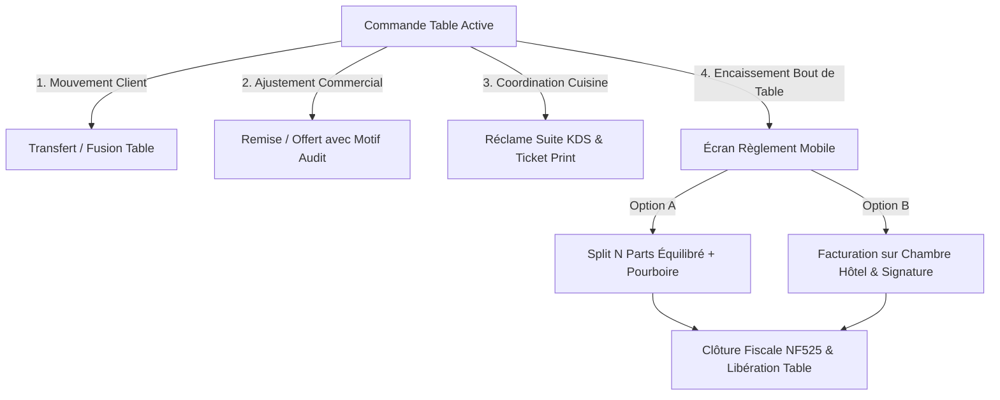

# Phase 1 Data Model: Fonctions Populaires d'Encaissement Mobile & Tablette (Restauration & Hôtellerie)

**Feature**: `012-mobile-hospitality-pos-features`  
**Date**: 2026-09-02

---

## 1. Énumérations et Structures de Données

### `CourseType` (Temps de service en cuisine)
```csharp
public enum CourseType
{
    Direct = 0,    // Entrée / À servir immédiatement
    Suite = 1,     // Plat principal / Envoyé sur réclame
    Dessert = 2,   // Dessert / Café
    OnDemand = 3   // Boissons / À la demande
}
```

### `DiscountType` (Type de remise commerciale)
```csharp
public enum DiscountType
{
    Percentage = 0,   // Remise en pourcentage (ex: 10%, 20%)
    FixedAmount = 1,  // Déduction en montant fixe (ex: 5.00 €)
    Comp = 2          // Article offert (100% de réduction)
}
```

### `PaymentMethod` (Moyens de paiement étendus)
```csharp
public enum PaymentMethod
{
    Cash = 0,
    CreditCard = 1,
    MealVoucher = 2,
    GiftCard = 3,
    RoomCharge = 4    // Facturation sur chambre d'hôtel / PMS
}
```

---

## 2. Entités et Modèles de Données

### `HotelRoomResident` (Simulation Registre PMS Hôtellerie)
```csharp
public class HotelRoomResident
{
    public Guid Id { get; init; } = UuidV7.NewGuid();
    public required string RoomNumber { get; set; }     // Ex: "204"
    public required string GuestName { get; set; }      // Ex: "Alexandre Dupont"
    public DateTimeOffset CheckInDateUtc { get; set; }
    public DateTimeOffset CheckOutDateUtc { get; set; }
    public bool IsOccupied { get; set; } = true;
    public decimal MaxCreditLimit { get; set; } = 500.0m;
    public decimal CurrentBalance { get; set; } = 0.0m;
}
```

### `RoomFolioCharge` (Pièce de charge sur chambre)
```csharp
public class RoomFolioCharge
{
    public Guid Id { get; init; } = UuidV7.NewGuid();
    public Guid OrderId { get; set; }
    public required string RoomNumber { get; set; }
    public required string GuestName { get; set; }
    public Money Amount { get; set; } = Money.Zero();
    public Money TipAmount { get; set; } = Money.Zero();
    public string? SignatureDataUrl { get; set; }
    public string? Notes { get; set; }
    public DateTimeOffset ChargedAtUtc { get; init; } = DateTimeOffset.UtcNow;
}
```

### `TableTransferLog` (Journal d'audit des transferts & fusions de tables)
```csharp
public class TableTransferLog
{
    public Guid Id { get; init; } = UuidV7.NewGuid();
    public required string SourceTableNumber { get; set; }
    public required string TargetTableNumber { get; set; }
    public Guid OrderId { get; set; }
    public Guid OperatorId { get; set; }
    public string OperatorName { get; set; } = string.Empty;
    public bool IsMerge { get; set; }
    public DateTimeOffset TimestampUtc { get; init; } = DateTimeOffset.UtcNow;
}
```

### `OrderDiscountAudit` (Journal d'audit des remises et offerts NF525)
```csharp
public class OrderDiscountAudit
{
    public Guid Id { get; init; } = UuidV7.NewGuid();
    public Guid OrderId { get; set; }
    public Guid? OrderItemId { get; set; }
    public DiscountType DiscountType { get; set; }
    public decimal Value { get; set; }
    public Money AmountSaved { get; set; } = Money.Zero();
    public required string Reason { get; set; }
    public Guid AuthorizedByOperatorId { get; set; }
    public DateTimeOffset AppliedAtUtc { get; init; } = DateTimeOffset.UtcNow;
}
```

---

## 3. DTOs de Requête et Réponse REST

### Transfert & Fusion
```csharp
public record TransferTableRequest(string TargetTableNumber, Guid OperatorId);
public record MergeTablesRequest(string TargetTableNumber, Guid OperatorId);
```

### Remises & Offerts
```csharp
public record ApplyOrderDiscountRequest(DiscountType Type, decimal Value, string Reason, Guid OperatorId);
public record CompOrderItemRequest(Guid ItemId, string Reason, Guid OperatorId);
```

### Réclame Cuisine
```csharp
public record FireCourseRequest(CourseType Course, string? StationFilter);
```

### Encaissement & Pourboire
```csharp
public record MobileCheckoutRequest(
    Guid OrderId,
    string TableNumber,
    Guid OperatorId,
    List<PaymentTenderRequest> Tenders,
    decimal TipAmount = 0.0m
);
public record RoomChargePaymentRequest(
    Guid OrderId,
    string TableNumber,
    string RoomNumber,
    string GuestName,
    decimal Amount,
    decimal TipAmount,
    string? SignatureDataUrl
);
```

---

## 4. Diagramme d'États & Flux de Travail Tactile


