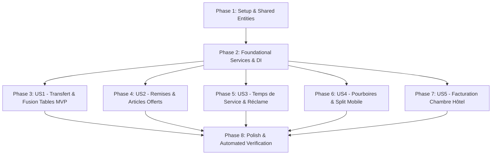

# Implementation Tasks: Fonctions Populaires d'Encaissement Mobile & Tablette (Restauration & Hôtellerie)

**Feature**: `012-mobile-hospitality-pos-features`  
**Specification**: [specs/012-mobile-hospitality-pos-features/spec.md](spec.md)  
**Implementation Plan**: [specs/012-mobile-hospitality-pos-features/plan.md](plan.md)  
**Status**: Completed  

---

## Phase 1: Setup (Shared Entities & Domain Models)

**Purpose**: Définir les nouvelles structures de données, entités et énumérations partagées.

- [X] T001 [P] Add domain entities `HotelRoomResident`, `RoomFolioCharge`, `TableTransferLog`, `OrderDiscountAudit` and enums `CourseType`, `DiscountType` in `src/RestaurantPos.Domain/Entities/`
- [X] T002 [P] Extend `PaymentMethod` enum with `RoomCharge = 4` in `src/RestaurantPos.Domain/Entities/FiscalReceipt.cs`
- [X] T003 [P] Add course fields (`CourseType`), discount/comp fields (`DiscountPercent`, `IsComp`, `CompReason`) to `OrderItem` and order-level discount fields to `Order` in `src/RestaurantPos.Domain/Entities/Order.cs`
- [X] T004 Add `DbSet` collections (`HotelRooms`, `RoomFolioCharges`, `TableTransferLogs`, `OrderDiscountAudits`) to `src/RestaurantPos.Infrastructure/Persistence/AppDbContext.cs`

---

## Phase 2: Foundational (Application Services & Master Data)

**Purpose**: Créer les interfaces applicatives, implémenter les services métiers de base et initialiser les données de démonstration hôtellerie.

- [X] T005 [P] Define `IOrderDiscountService`, `IRoomBillingService`, and extend `ITableManagementService` with `MergeTablesAsync` in `src/RestaurantPos.Application/Common/Interfaces/`
- [X] T006 [P] Implement `OrderDiscountService` in `src/RestaurantPos.Infrastructure/Services/OrderDiscountService.cs`
- [X] T007 [P] Implement `RoomBillingService` with PMS room resident lookup and folio charging in `src/RestaurantPos.Infrastructure/Services/RoomBillingService.cs`
- [X] T008 [P] Implement `MergeTablesAsync` and enhance `TransferTableAsync` in `src/RestaurantPos.Infrastructure/Services/TableManagementService.cs`
- [X] T009 Register services in DI and seed sample hotel rooms (Ch. 201, 204, 305) in `src/RestaurantPos.Api/Program.cs`

**Checkpoint**: Socle de données et services applicatifs opérationnels.

---

## Phase 3: User Story 1 - Transfert et Fusion de Tables (Priority: P1) 🎯 MVP

**Goal**: Permettre aux serveurs de déplacer une commande vers une table libre ou de fusionner deux tables occupées directement sur tablette.

**Independent Test**: Ouvrir `T1` avec 3 articles $\to$ Transférer vers `T4` libre $\to$ `T1` devient libre et `T4` reprend les 3 articles.

### Tests for User Story 1

- [X] T010 [P] [US1] Create unit tests for table transfer and merge in `tests/RestaurantPos.Infrastructure.Tests/TableTransferAndMergeTests.cs`

### Implementation for User Story 1

- [X] T011 [US1] Expose REST endpoints `POST /api/tables/{tableNumber}/transfer` and `POST /api/tables/{tableNumber}/merge` in `src/RestaurantPos.Api/Program.cs`
- [X] T012 [US1] Add `transferTableModal` and `mergeTableModal` markup with tactile table selectors in `src/RestaurantPos.Api/wwwroot/index.html`
- [X] T013 [US1] Implement table transfer/merge handlers and live floorplan refresh in `src/RestaurantPos.Api/wwwroot/app.js`

**Checkpoint**: User Story 1 (Transfert & Fusion de tables) complète et testable de bout en bout.

---

## Phase 4: User Story 2 - Gestion des Remises & Articles Offerts (Priority: P1)

**Goal**: Appliquer des remises en % ou montant fixe et passer des articles en offert avec saisie obligatoire d'un motif et traçabilité NF525.

**Independent Test**: Sélectionner un dessert à 8.00 € $\to$ Clic « 🎁 Offert » $\to$ motif « Geste fidélité » $\to$ ligne à 0.00 € et total recalculé.

### Tests for User Story 2

- [X] T014 [P] [US2] Create unit tests for discounts, comps, and tax calculations in `tests/RestaurantPos.Infrastructure.Tests/OrderDiscountServiceTests.cs`

### Implementation for User Story 2

- [X] T015 [US2] Expose REST endpoints `POST /api/orders/{orderId}/discount` and `POST /api/orders/{orderId}/items/{itemId}/comp` in `src/RestaurantPos.Api/Program.cs`
- [X] T016 [US2] Add `discountModal` and `compItemModal` dialogs with mandatory reason input in `src/RestaurantPos.Api/wwwroot/index.html`
- [X] T017 [US2] Implement discount application, comp line rendering, and dynamic cart refresh in `src/RestaurantPos.Api/wwwroot/app.js`

**Checkpoint**: User Story 2 (Remises & Offerts) complète et auditable.

---

## Phase 5: User Story 3 - Prise de Commande par Temps de Service & Réclame Cuisine (Priority: P2)

**Goal**: Catégoriser les plats en « Direct », « Suite », « Dessert » et envoyer un ordre instantané « 🔔 Réclamer la Suite » vers la cuisine.

**Independent Test**: Commande avec entrées (« Direct ») et plats (« Suite ») $\to$ Clic « 🔔 Réclamer Suite » $\to$ KDS et imprimante reçoivent l'ordre de réclame.

### Tests for User Story 3

- [X] T018 [P] [US3] Create unit tests for course firing and kitchen notifications in `tests/RestaurantPos.Infrastructure.Tests/KitchenCourseFireTests.cs`

### Implementation for User Story 3

- [X] T019 [US3] Expose REST endpoint `POST /api/tables/{tableNumber}/fire-suite` with SignalR broadcast in `src/RestaurantPos.Api/Program.cs`
- [X] T020 [US3] Add course badge selectors on cart items and `🔔 Réclamer Suite` rush button in `src/RestaurantPos.Api/wwwroot/index.html`
- [X] T021 [US3] Implement course tagging in cart and suite claim broadcast handler in `src/RestaurantPos.Api/wwwroot/app.js`

**Checkpoint**: User Story 3 (Temps de service & Réclame cuisine) complète.

---

## Phase 6: User Story 4 - Encaissement Mobile au Bout de Table avec Pourboire & Split (Priority: P2)

**Goal**: Proposer des touches de pourboire rapide (5%, 10%, 15%, Libre) et un calcul de division en N parts équilibré au centime près.

**Independent Test**: Note de 50.00 € $\to$ Split en 3 parts $\to$ 16.67 € + 16.67 € + 16.66 € avec pourboire de 2.00 € sur CB $\to$ clôture exacte à 100%.

### Tests for User Story 4

- [X] T022 [P] [US4] Create unit tests for tip recording and balanced split partitions in `tests/RestaurantPos.Infrastructure.Tests/MobileCheckoutTipTests.cs`

### Implementation for User Story 4

- [X] T023 [US4] Add tip selector buttons (0%, 5%, 10%, 15%, Libre) and N-guest split controls in `src/RestaurantPos.Api/wwwroot/index.html`
- [X] T024 [US4] Implement mobile checkout with tip calculation and balanced split settlement in `src/RestaurantPos.Api/wwwroot/app.js`

**Checkpoint**: User Story 4 (Pourboires & Split mobile) complète.

---

## Phase 7: User Story 5 - Facturation sur Chambre d'Hôtel / Compte Folio (Priority: P3)

**Goal**: Permettre le règlement d'une addition en l'imputant sur la chambre d'un client de l'hôtel avec signature tactile sur écran.

**Independent Test**: Note Bar de 25.00 € $\to$ Règlement « 🏨 Chambre » $\to$ Ch. 204 (Alexandre Dupont) $\to$ Signature sur canvas $\to$ Note clôturée.

### Tests for User Story 5

- [X] T025 [P] [US5] Create unit tests for room lookup and folio charge creation in `tests/RestaurantPos.Infrastructure.Tests/RoomBillingServiceTests.cs`

### Implementation for User Story 5

- [X] T026 [US5] Expose REST endpoints `GET /api/hotel/rooms/{roomNumber}` and `POST /api/hotel/room-charge` in `src/RestaurantPos.Api/Program.cs`
- [X] T027 [US5] Add `roomChargeModal` with room search and HTML5 signature canvas in `src/RestaurantPos.Api/wwwroot/index.html`
- [X] T028 [US5] Implement room lookup, canvas signature capture, and folio charge settlement in `src/RestaurantPos.Api/wwwroot/app.js`

**Checkpoint**: User Story 5 (Facturation sur chambre d'hôtel) complète.

---

## Phase 8: Polish & Automated Verification

**Purpose**: Script de validation automatisé et exécution complète des tests.

- [X] T029 [P] Create automated PowerShell verification script `scripts/powershell/verify-012-hospitality-features.ps1`
- [X] T030 Execute full test suite (`dotnet test`) across all projects with 0 errors and 0 warnings

---

## Dependencies & Execution Order

---

## Implementation Strategy

### MVP First (User Story 1 & 2)
1. Créer les entités et tables de persistance EF Core (`HotelRoomResident`, `RoomFolioCharge`, `OrderDiscountAudit`, `TableTransferLog`).
2. Implémenter le transfert/fusion de table et les remises/offerts avec modales tactiles.
3. Valider avec tests unitaires et flux de caisse.
