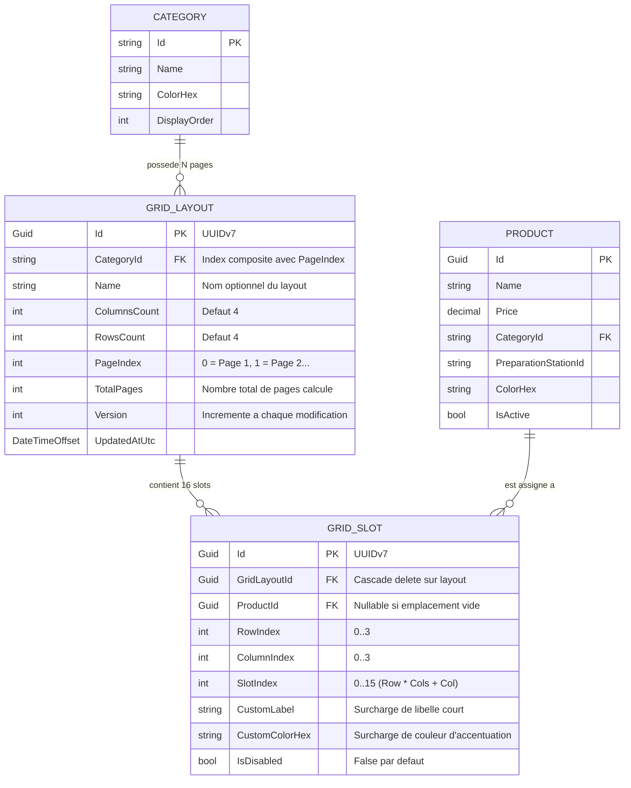

# Data Model: Grille Tactile avec Pagination Multi-Pages & Zero-Scrollbar

**Feature**: `013-customizable-touch-grid`  
**Date**: 2026-09-03  
**Status**: Ready

---

## 1. Schéma Entités Relationnelles (EF Core & SQLite)



---

## 2. Contraintes d'Intégrité & Index

- **Index Unique sur `GridLayout`** : `(CategoryId, PageIndex)` garantit qu'il n'existe qu'une seule page $P$ pour une catégorie $C$ donnée.
- **Index Unique sur `GridSlot`** : `(GridLayoutId, RowIndex, ColumnIndex)` garantit qu'une case matricielle est unique par page.
- **Contrainte de Suppression** : `GridSlot.ProductId` est configuré avec `.OnDelete(DeleteBehavior.SetNull)` pour qu'un archivage produit libère la case sans supprimer le slot.

---

## 3. Data Transfer Objects (Application Layer)

```csharp
namespace RestaurantPos.Application.DTOs;

public record GridLayoutDto
{
    public Guid Id { get; init; }
    public string CategoryId { get; init; } = string.Empty;
    public string? Name { get; init; }
    public int ColumnsCount { get; init; } = 4;
    public int RowsCount { get; init; } = 4;
    public int PageIndex { get; init; } = 0;
    public int TotalPages { get; init; } = 1;
    public int Version { get; init; } = 1;
    public DateTimeOffset UpdatedAtUtc { get; init; }
    public List<GridSlotDto> Slots { get; init; } = new();
}

public record GridSlotDto
{
    public Guid Id { get; init; }
    public Guid GridLayoutId { get; init; }
    public Guid? ProductId { get; init; }
    public int RowIndex { get; init; }
    public int ColumnIndex { get; init; }
    public int SlotIndex { get; init; }
    public string? CustomLabel { get; init; }
    public string? CustomColorHex { get; init; }
    public bool IsDisabled { get; init; }
    public ProductSummaryDto? Product { get; init; }
}

public record ProductSummaryDto(
    Guid Id,
    string Name,
    decimal Price,
    string? PreparationStationId,
    string? ColorHex
);

public record UpdateGridLayoutRequest(
    string CategoryId,
    int ColumnsCount,
    int RowsCount,
    int PageIndex,
    List<UpdateGridSlotItem> Slots
);

public record UpdateGridSlotItem(
    int RowIndex,
    int ColumnIndex,
    Guid? ProductId,
    string? CustomLabel,
    string? CustomColorHex
);

public record SwapGridSlotsRequest(
    Guid LayoutId,
    int SourceRow,
    int SourceCol,
    int TargetRow,
    int TargetCol
);
```
