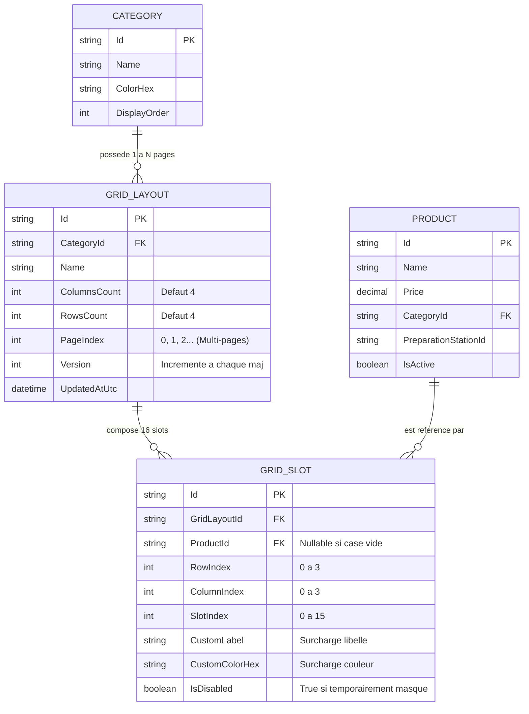

# Feature Specification: Grille Tactile Personnalisable d'Articles avec Pagination & Interface Sans Ascenseur (POS Tablette)

**Feature Branch**: `013-customizable-touch-grid`  
**Created**: 2026-09-02  
**Updated**: 2026-09-03  
**Status**: Ready for Planning  
**Input**: User description: "met a jour 013 en ajoutant la possibilité de paginer dans l'écran et éliminer l'ascenseur pour tous les écrans"

---

## 1. Contexte & Vision Produit

Dans un environnement de restauration à fort débit (coup de feu, service au bar, terrasses, vente au comptoir), l'ergonomie, la stabilité visuelle et la rapidité de saisie des articles sur écran tactile sont des facteurs critiques de productivité.

L'objectif de cette évolution est double :
1. **Pagination Tactile Multi-Pages par Catégorie** : Permettre à chaque catégorie de comporter plusieurs pages de grilles (ex: Page 1/3, Page 2/3, Page 3/3) sur une matrice $4 \times 4$ fixe (16 articles par page), navigables instantanément au doigt via des commandes tactiles dédiées (boutons Précédent `◀`, Suivant `▶`, pastilles `● ○ ○`), sans perte de fluidité.
2. **Élimination Intégrale de l'Ascenseur sur Tous les Écrans (Zero-Scrollbar / Fixed Viewport)** : Concevoir l'ensemble de l'application de caisse (Écran de vente, Plan de salle, Écran cuisine KDS, Panneau d'administration, Modales) pour qu'elle s'ajuste à 100% du viewport de la tablette (`100vh` / `100vw`). Aucune barre de défilement (ascenseur vertical ou horizontal) ne doit apparaître sur aucun écran, évitant les décalages accidentels lors des interactions tactiles rapides.

---

## Clarifications

### Session 2026-09-03
- Q: Lors du changement de catégorie sur l'écran de vente, la grille doit-elle toujours s'ouvrir sur la Page 1 ou mémoriser la dernière page consultée ? → A: Option A — Toujours réinitialiser à la Page 1 (`PageIndex = 0`) au changement de catégorie pour préserver la mémoire musculaire du serveur sur les articles prioritaires.

---

## 2. User Scenarios & Testing *(mandatory)*

### User Story 1 - Saisie Tactile sur Grille Homogène Multi-Pages (Priority: P1) 🎯 MVP

En tant que **serveur ou caissier**,  
Je veux naviguer entre les pages d'une même catégorie via des boutons tactiles clairs et visualiser les articles sur une matrice carrée $4 \times 4$ fixe sans défilement vertical,  
Afin d'accéder rapidement à l'ensemble du catalogue de la catégorie sans ascenseur et sans perturber mes repères spatiaux.

**Why this priority**: C'est le cœur de l'expérience d'encaissement. Lorsque le nombre d'articles d'une catégorie dépasse 16, la pagination préserve le ratio carré 1:1 sans introduire de défilement.

**Independent Test**: Ouvrir une catégorie dense (> 16 articles), vérifier la présence de la barre de pagination, naviguer entre les pages 1 et 2 en moins de 50ms et ajouter un article de la page 2 au panier.

**Acceptance Scenarios**:

1. **Given** une catégorie contenant 24 articles, **When** le serveur affiche la catégorie, **Then** la Page 1 affiche les 16 premiers emplacements carrés (4×4) et un indicateur de pagination « Page 1 / 2 » avec boutons tactiles `◀` (désactivé) et `▶` (actif).
2. **Given** l'écran de vente sur la Page 1, **When** le serveur tape sur le bouton tactile `▶` ou la pastille de page 2, **Then** la matrice bascule immédiatement (< 50ms) sur la Page 2 affichant les 8 articles suivants et 8 cases vides spatialement conservées.
3. **Given** une case de la grille non assignée sur n'importe quelle page, **When** la grille est rendue, **Then** la case vide conserve son empreinte spatiale invisible/placeholder afin de maintenir l'alignement strict de la matrice.
4. **Given** un appui sur une tuile article de la page active, **When** le serveur touche la tuile, **Then** un retour visuel instantané (< 50ms) est déclenché et l'article est ajouté au panier courant.

---

## User Story 2 - Configuration Visuelle & Pagination dans l'Éditeur Back-Office (Priority: P2)

En tant que **responsable de restaurant ou administrateur**,  
Je veux configurer les emplacements d'articles sur plusieurs pages pour chaque catégorie, ajouter/supprimer des pages de grille et déplacer des articles entre les pages par glisser-déposer,  
Afin d'organiser logiquement les produits fréquents sur la Page 1 et les variantes ou produits occasionnels sur les pages suivantes.

**Why this priority**: Permet aux gérants de structurer le catalogue sans limite de 16 articles tout en gardant une interface claire.

**Independent Test**: Ouvrir l'éditeur de grille, changer de page (Page 1 $\rightarrow$ Page 2), assigner un article sur la Page 2, et vérifier sa présence en caisse sur la Page 2.

**Acceptance Scenarios**:

1. **Given** l'éditeur de grille d'une catégorie sélectionnée, **When** l'administrateur visualise la barre de pagination, **Then** il peut basculer entre les pages existantes (`Page 1`, `Page 2`, etc.) ou cliquer sur « ➕ Ajouter une page ».
2. **Given** un article sur la Page 1, **When** l'administrateur le déplace ou l'assigne sur la Page 2, **Then** les coordonnées matricielles `(PageIndex, RowIndex, ColumnIndex)` sont mises à jour et persistées.
3. **Given** deux articles sur une même page de configuration, **When** l'administrateur glisse l'article A sur l'article B, **Then** le système permute automatiquement leurs positions.
4. **Given** une page additionnelle vide (ex: Page 2 sans aucun article assigné), **When** l'administrateur clique sur « Supprimer la page », **Then** la page est retirée et la pagination réajustée.

---

## User Story 3 - Personnalisation Visuelle Locale des Tuiles (Priority: P3)

En tant que **responsable de restaurant**,  
Je veux définir une couleur d'accentuation spécifique ou un libellé court d'affichage pour chaque tuile sur n'importe quelle page,  
Afin de faciliter la reconnaissance visuelle instantanée des produits phares.

**Why this priority**: Réduit les erreurs de saisie en heure de pointe et optimise la vitesse de commande.

**Independent Test**: Personnaliser une tuile sur la Page 2 (libellé court + couleur) et vérifier son rendu sur l'écran de vente.

**Acceptance Scenarios**:

1. **Given** une tuile d'article sélectionnée sur la Page 1 ou 2, **When** l'administrateur définit le libellé court « PIZZA MARGHE » et la couleur `#E74C3C`, **Then** ces attributs sont appliqués et affichés en caisse prioritairement au libellé catalogue standard.

---

## User Story 4 - Interface Globale 100% Ajustée au Viewport Sans Ascenseur (Priority: P1) 🎯 MVP

En tant que **personnel de service (serveur, caissier, cuisinier, gérant)**,  
Je veux que tous les écrans du système POS (Vente, Plan de salle, Cuisine KDS, Clôture Z, Paramétrage, Modales) soient parfaitement ajustés à la hauteur de l'écran sans aucune barre de défilement / ascenseur visible,  
Afin d'éviter tout défilement vertical parasite ou manipulation accidentelle lors des gestes tactiles rapides.

**Why this priority**: Sur une tablette POS tactile professionnelle, l'apparition de barres d'ascenseur du navigateur ou de scrollbars de page nuit gravement à la fluidité, casse l'ancrage tactile et dégrade l'expérience utilisateur.

**Independent Test**: Parcourir chaque écran de l'application (Vente, Tables, KDS, Admin, Modales d'encaissement et de clôture) sur différentes résolutions de tablettes (iPad 10.9", iPad Pro 12.9", tablettes Android 1080p) et vérifier qu'aucune barre d'ascenseur n'apparaît et qu'aucun défilement de page global n'est possible.

**Acceptance Scenarios**:

1. **Given** l'écran de vente (Caisse), **When** la liste de commande contient plus de 10 articles, **Then** la zone du panier défile de manière fluide et autonome au doigt sans afficher de scrollbar navigateur apparente (`scrollbar-width: none;`), tandis que le reste de l'écran (grille, pavé, totaux, navigation) reste strictement verrouillé dans le viewport.
2. **Given** l'écran Plan de Salle, **When** la disposition des tables est affichée, **Then** la grille de salle occupe 100% de l'espace disponible sans barre de défilement verticale ou horizontale.
3. **Given** l'écran Cuisine (KDS), **When** de multiples commandes sont en préparation, **Then** la vue KDS s'organise en colonnes ou pagination horizontale fluide sans ascenseur vertical global.
4. **Given** l'écran Paramétrage (Admin), **When** les onglets Catalogue, Personnel, Imprimantes ou Grille Tactile sont affichés, **Then** le conteneur principal reste bloqué à la hauteur de la vue et les sous-listes intègrent leur propre pagination ou zone défilante invisible.
5. **Given** l'ouverture d'une modale (Encaissement, Division de note, Clôture Z, Édition de slot), **When** la modale s'affiche, **Then** son contenu est dimensionné pour tenir entièrement dans la fenêtre sans ascenseur externe.

---

## User Story 5 - Résilience Hors-Ligne & Synchronisation Multi-Terminaux (Priority: P4)

En tant que **système de caisse multi-tablettes**,  
Je veux que toute modification de disposition et de pagination soit enregistrée immédiatement en local (SQLite / cache) et répercutée en temps réel sur les autres tablettes du réseau local,  
Afin d'assurer une expérience homogène sans dépendre d'une connexion Internet externe.

**Acceptance Scenarios**:

1. **Given** une modification de la page 2 d'une catégorie sur la tablette A, **When** la modification est enregistrée, **Then** elle est diffusée via SignalR aux tablettes connectées qui mettent à jour leur cache local et rafraîchissent instantanément l'affichage.

---

## 3. Requirements *(mandatory)*

### Functional Requirements

- **FR-001**: Le système DOIT afficher les articles de vente sous forme d'une matrice carrée homogène ($4 \times 4$, 16 emplacements) par page, avec gouttière (`gap`) uniforme et sans déformation.
- **FR-002**: Le système DOIT supporter la pagination multi-pages par catégorie (`PageIndex` $\ge 0$), permettant de disposer $16 \times N$ articles par catégorie.
- **FR-003**: Le système DOIT fournir des commandes de pagination tactiles intuitives sur l'écran de vente (boutons `◀ Précédent`, `▶ Suivant`, pastilles `● ○ ○` et libellé `Page X / Y`) et DOIT toujours réinitialiser l'affichage sur la Page 1 (`PageIndex = 0`) lors de la sélection d'un nouvel onglet de catégorie.
- **FR-004**: Le système DOIT masquer automatiquement les contrôles de pagination lorsqu'une catégorie ne comporte qu'une seule page (16 articles ou moins).
- **FR-005**: Le système DOIT éliminer tout ascenseur (barres de défilement verticales et horizontales) sur 100% des écrans de l'application (`body`, conteneurs principaux, vues et modales).
- **FR-006**: Le système DOIT masquer visuellement toutes les barres de défilement natives du navigateur (`scrollbar-width: none; -ms-overflow-style: none; ::-webkit-scrollbar { display: none; }`) tout en préservant le défilement tactile naturel (inertiel/touch scroll) dans les zones internes débordantes (ex: panier de caisse).
- **FR-007**: L'éditeur d'administration DOIT intégrer une barre d'onglets de pages (`Page 1`, `Page 2`, `➕ Page`) pour permettre la gestion visuelle du glisser-déposer sur n'importe quelle page d'une catégorie.
- **FR-008**: L'éditeur DOIT permettre le déplacement d'un article d'une page à une autre et la permutation (swap) de coordonnées intra-page.
- **FR-009**: Le système DOIT persister la configuration multi-pages des grilles dans la base de données SQLite locale et sur le serveur central.
- **FR-010**: Le système DOIT propager les mises à jour de layout multi-pages en temps réel via SignalR vers tous les terminaux de caisse.
- **FR-011**: Le temps de réponse tactile au changement de page DOIT être inférieur à 50ms.

---

### Key Entities & Data Model

#### Entités Détaillées

1. **`GridLayout` (Page de Grille)** :
   - `Id` (GUID / UUIDv7, Clé primaire)
   - `CategoryId` (Référence vers la catégorie parente)
   - `ColumnsCount` (Nombre de colonnes, défaut : 4)
   - `RowsCount` (Nombre de lignes, défaut : 4)
   - `PageIndex` (Index de la page : 0 pour Page 1, 1 pour Page 2, etc.)
   - `Version` (Entier incrémenté pour la synchronisation et la gestion de cache)
   - `UpdatedAtUtc` (Horodatage de la dernière modification)

2. **`GridSlot` (Emplacement Matriciel)** :
   - `Id` (GUID / UUIDv7, Clé primaire)
   - `GridLayoutId` (Clé étrangère vers `GridLayout`)
   - `ProductId` (Clé étrangère vers `Product`, NULL si case vide)
   - `RowIndex` (Index de ligne 0 à 3)
   - `ColumnIndex` (Index de colonne 0 à 3)
   - `SlotIndex` (Position séquentielle $0 \le \text{SlotIndex} < 16$)
   - `CustomLabel` (Libellé court personnalisé, facultatif)
   - `CustomColorHex` (Couleur d'accentuation personnalisée, facultatif)

---

## 4. Success Criteria *(mandatory)*

### Measurable Outcomes

- **SC-001**: **0% d'ascenseur visible** : 100% des écrans de l'application (Vente, Tables, KDS, Paramétrage, Modales) s'affichent sans aucune barre de défilement du navigateur sur les résolutions de tablettes cibles ($\ge 1024 \times 768$).
- **SC-002**: La transition tactile entre deux pages d'une catégorie s'exécute en **moins de 50 millisecondes**.
- **SC-003**: Le système supporte jusqu'à **10 pages de 16 articles par catégorie** (soit 160 articles par catégorie) sans ralentissement ni dégradation de fluidité.
- **SC-004**: 100% des configurations multi-pages sont sauvegardées et synchronisées en local-first avec réplication SignalR en **moins de 300 millisecondes**.
- **SC-005**: Aucun défilement vertical global de la page n'est déclenché lors des appuis répétés ou glissements sur les touches d'articles.

---

## 5. Assumptions

1. **Format Matriciel Fixe** : La grille de caisse adopte un format strict $4 \times 4$ (16 articles par page) pour optimiser la mémoire musculaire.
2. **Support Tactile et Gestuel** : La pagination peut être actionnée soit par les boutons tactiles de navigation (`◀` / `▶` / pastilles), soit par swipe gestuel horizontal sur la grille.
3. **Discrétion Visuelle du Scroll Interne** : Dans les zones où un grand nombre d'éléments doit défiler (ex: panier de vente de 30 articles), le défilement tactile est fluide mais les barres d'ascenseur restent invisibles pour un rendu épuré type application native tactile.
