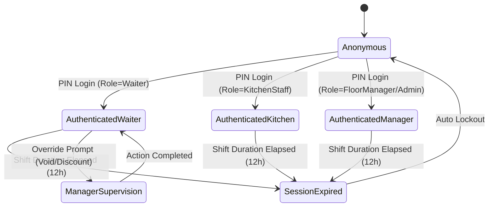

# Phase 1: Data Model & Security Schema

**Feature**: Backend API Authentication & Multi-Role Authorization  
**Directory**: `specs/014-backend-api-auth`  
**Date**: 2026-09-03  

## 1. Domain Entities & Value Objects

### `User` (Staff Member)
Existing entity in `RestaurantPos.Domain.Entities`:
- `Id`: `Guid` (Primary Key, UUIDv7)
- `Name`: `string` (Full display name, e.g. "Alexandre Dupont (Manager)")
- `Role`: `UserRole` enum (`Admin = 0`, `FloorManager = 1`, `Waiter = 2`, `KitchenStaff = 3`)
- `PinHash`: `string` (Salted SHA-256 / PBKDF2 hash)
- `PinSalt`: `string` (Cryptographic random salt, base64)
- `IsActive`: `bool` (Active status, soft-disable flag)
- `CreatedAtUtc`: `DateTimeOffset`
- `UpdatedAtUtc`: `DateTimeOffset`

---

## 2. Authentication DTOs & Contracts

### `PinLoginRequest`
```csharp
public sealed record PinLoginRequest(
    string Pin
);
```

### `AuthLoginResponse`
```csharp
public sealed record AuthLoginResponse(
    bool Success,
    Guid? OperatorId,
    string? OperatorName,
    string? Role,
    string? Token,
    string? Message = null
);
```

### `OperatorSessionClaims`
Payload claims embedded inside the cryptographically signed JWT:
| Claim Type | Standard JWT Name | Description | Example |
| :--- | :--- | :--- | :--- |
| `Subject` | `sub` | Unique Operator UUID | `01a067d9-b861-7259-8471-73a4ce48d469` |
| `Name` | `name` | Formatted staff member name | `Alexandre Dupont (Manager)` |
| `Role` | `http://schemas.microsoft.com/ws/2008/06/identity/claims/role` | Assigned RBAC role | `FloorManager` |
| `TokenId` | `jti` | Unique token identifier | `8ce00c49-091b-4621-91be-8a98e9a9fc29` |
| `ExpiresAt` | `exp` | Token expiration timestamp (Unix seconds) | `1788491958` |

---

## 3. Test & Development Security Models

### `TestAuthHeaders`
Headers recognized in `Testing` and `Development` environments:
- `X-Test-Role`: Simulates the caller's role (`Admin`, `FloorManager`, `Waiter`, `KitchenStaff`).
- `X-Test-Operator-Id`: Optional custom Operator UUID for tests.
- `X-Test-Operator-Name`: Optional custom display name.

### State Transitions


