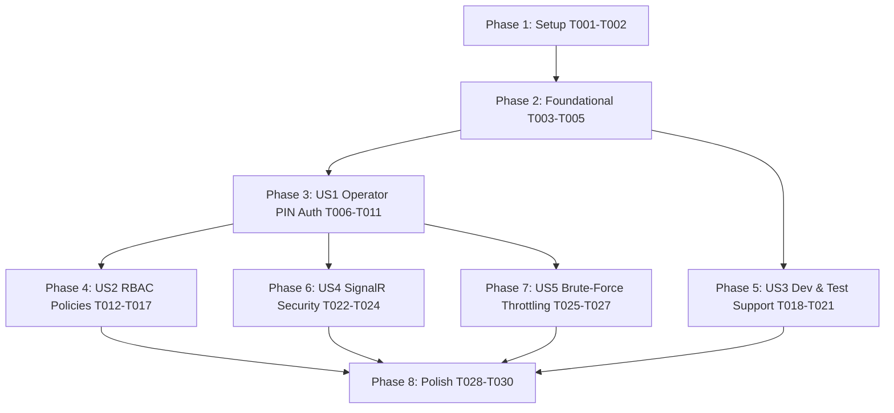

# Tasks: Backend API Authentication & Multi-Role Authorization

**Input**: Design documents from `/specs/014-backend-api-auth/`
**Prerequisites**: [plan.md](plan.md), [spec.md](spec.md), [research.md](research.md), [data-model.md](data-model.md), [contracts/auth-api.yaml](contracts/auth-api.yaml)

## Format: `[ID] [P?] [Story] Description`

- **[P]**: Can run in parallel (different files, no dependencies)
- **[Story]**: Which user story this task belongs to (e.g. US1, US2, US3, US4, US5)
- Every task includes the exact file path

---

## Phase 1: Setup (Shared Infrastructure)

**Purpose**: Core security configuration and authorization policy registration

- [ ] T001 Configure named authorization policies (`RequireAuthenticatedOperator`, `RequireManagerOrAdmin`, `RequireKitchenOrAdmin`) in `src/RestaurantPos.Api/Program.cs`
- [ ] T002 [P] Register JWT Bearer validation parameters and secret key configuration in `src/RestaurantPos.Api/Program.cs`

---

## Phase 2: Foundational (Blocking Prerequisites)

**Purpose**: Testing authentication infrastructure that MUST be complete before user story testing and endpoint locking

- [ ] T003 [P] Create `TestAuthHandler.cs` supporting `X-Test-Role` header claims in `tests/RestaurantPos.Api.Tests/TestAuthHandler.cs`
- [ ] T004 Update `PosApiApplicationFactory.cs` in `tests/RestaurantPos.Api.Tests/PosApiApplicationFactory.cs` to configure `TestAuthHandler` under `Testing` environment
- [ ] T005 [P] Add authorization extension helpers in `src/RestaurantPos.Api/Endpoints/AuthEndpoints.cs`

**Checkpoint**: Foundation ready - testing harness can assert any role without database login dependencies.

---

## Phase 3: User Story 1 - Fast Operator Authentication & Session Protection (Priority: P1) 🎯 MVP

**Goal**: Operators authenticate via PIN code, receive signed JWT tokens, and mutating operations reject unauthenticated calls.

**Independent Test**: Send valid/invalid PIN requests to `/api/auth/login`. Verify valid login yields token within 50ms, while unauthenticated calls to table/checkout endpoints return 401 Unauthorized.

- [ ] T006 [P] [US1] Write integration test for successful PIN login and token retrieval in `tests/RestaurantPos.Api.Tests/AuthEndpointsTests.cs`
- [ ] T007 [P] [US1] Write integration test verifying invalid PIN returns 401 in `tests/RestaurantPos.Api.Tests/AuthEndpointsTests.cs`
- [ ] T008 [US1] Implement `GET /api/auth/me` endpoint returning current operator profile in `src/RestaurantPos.Api/Endpoints/AuthEndpoints.cs`
- [ ] T009 [US1] Protect table mutation endpoints with `RequireAuthorization()` in `src/RestaurantPos.Api/Endpoints/TableEndpoints.cs`
- [ ] T010 [US1] Protect payment & checkout endpoints with `RequireAuthorization()` in `src/RestaurantPos.Api/Endpoints/CheckoutEndpoints.cs`
- [ ] T011 [US1] Update `app.js` in `src/RestaurantPos.Api/wwwroot/app.js` to attach token on all mutating requests and refresh session on login

**Checkpoint**: User Story 1 is functional and verifiable independently.

---

## Phase 4: User Story 2 - Role-Based Access Control (RBAC) on Sensitive Operations (Priority: P1)

**Goal**: Enforce authorization boundaries so that receipt voids, staff changes, and daily Z-closures require Manager or Admin roles.

**Independent Test**: Authenticate as `Waiter` and attempt a receipt void (verify 403 Forbidden). Authenticate as `FloorManager` and attempt the same void (verify 200 OK).

- [ ] T012 [P] [US2] Write integration test verifying Waiter role is rejected on receipt void in `tests/RestaurantPos.Api.Tests/AuthEndpointsTests.cs`
- [ ] T013 [P] [US2] Write integration test verifying Manager/Admin role is permitted on receipt void in `tests/RestaurantPos.Api.Tests/AuthEndpointsTests.cs`
- [ ] T014 [US2] Enforce `RequireAuthorization("RequireManagerOrAdmin")` on void endpoint in `src/RestaurantPos.Api/Endpoints/CheckoutEndpoints.cs`
- [ ] T015 [US2] Enforce `RequireAuthorization("RequireManagerOrAdmin")` on daily fiscal Z-closure in `src/RestaurantPos.Api/Endpoints/FiscalEndpoints.cs`
- [ ] T016 [US2] Enforce `RequireAuthorization("RequireManagerOrAdmin")` on staff mutation endpoints in `src/RestaurantPos.Api/Endpoints/StaffEndpoints.cs`
- [ ] T017 [US2] Implement supervisor override endpoint `POST /api/auth/override` in `src/RestaurantPos.Api/Endpoints/AuthEndpoints.cs`

**Checkpoint**: User Story 2 is functional and verifiable independently.

---

## Phase 5: User Story 3 - Development & Automated Testing Environment Support (Priority: P1)

**Goal**: Non-blocking test execution across entire test suite (`dotnet test`) and frictionless local development.

**Independent Test**: Run `dotnet test` across all 4 test projects and verify 100% pass rate with zero manual authentication required.

- [ ] T018 [P] [US3] Add unit tests for `TestAuthHandler` role claims synthesis in `tests/RestaurantPos.Api.Tests/TestAuthHandlerTests.cs`
- [ ] T019 [US3] Conditionally register `TestAuthHandler` in `src/RestaurantPos.Api/Program.cs` only when running in `Testing` environment
- [ ] T020 [US3] Ensure default test seed accounts (`1234` Manager, `2468` Waiter, `5678` Chef, `9999` Admin) are loaded in `src/RestaurantPos.Api/Program.cs`
- [ ] T021 [US3] Run full solution test suite `dotnet test` and verify all 101 tests pass cleanly

**Checkpoint**: User Story 3 is complete and CI/CD test suite is 100% green.

---

## Phase 6: User Story 4 - Terminal Device Registration & Real-Time Channel Security (Priority: P2)

**Goal**: Secure SignalR real-time websocket connections with token query parameter authentication while preserving passive floor displays.

**Independent Test**: Connect to `/hubs/pos` with valid token (verify accepted). Connect with invalid/missing token (verify unauthorized in production).

- [ ] T022 [P] [US4] Configure `JwtBearerEvents.OnMessageReceived` in `src/RestaurantPos.Api/Program.cs` to read `access_token` query string for `/hubs/pos`
- [ ] T023 [US4] Update `PosHub.cs` in `src/RestaurantPos.Api/Hubs/PosHub.cs` to validate client authorization and map operator context
- [ ] T024 [US4] Update `KitchenSignalRClient.cs` and `TableSignalRClient.cs` in `src/RestaurantPos.Client.Maui/Services/` to supply bearer token on hub connection

**Checkpoint**: User Story 4 is functional and verified.

---

## Phase 7: User Story 5 - Brute-Force Throttling & Security Audit Logging (Priority: P3)

**Goal**: Throttle repeated failed PIN attempts and log security events for auditability.

**Independent Test**: Dispatch 5 consecutive wrong PINs; verify 6th attempt is rate-limited with backoff delay.

- [ ] T025 [P] [US5] Implement `PinRateLimiterService` sliding window limiter in `src/RestaurantPos.Infrastructure/Security/PinRateLimiterService.cs`
- [ ] T026 [US5] Wire rate limiter into `POST /api/auth/login` in `src/RestaurantPos.Api/Endpoints/AuthEndpoints.cs`
- [ ] T027 [US5] Add structured `ILogger` security event logs for authentication successes, failures, and overrides in `src/RestaurantPos.Api/Endpoints/AuthEndpoints.cs`

**Checkpoint**: User Story 5 is functional and verified.

---

## Phase 8: Polish & Cross-Cutting Concerns

**Purpose**: Final verification, OpenAPI compliance, and clean build checks

- [ ] T028 [P] Update OpenAPI Swagger documentation with `BearerAuth` security scheme in `src/RestaurantPos.Api/Program.cs`
- [ ] T029 Execute full quickstart validation scenarios from `specs/014-backend-api-auth/quickstart.md`
- [ ] T030 Verify zero compiler warnings across all projects with `dotnet build` (`TreatWarningsAsErrors=true`)

---

## Dependencies & Execution Order

### Parallel Opportunities

- **Phase 1 & Phase 2**: `T002` (JWT params) and `T003` (TestAuthHandler) can run in parallel.
- **Phase 3 (US1)**: `T006` (happy path test) and `T007` (unauthorized test) can run in parallel.
- **Phase 4 (US2)**: `T012` (waiter forbidden test) and `T013` (manager allowed test) can run in parallel.
- **Phase 6 & Phase 7**: User Story 4 (SignalR) and User Story 5 (Rate Limiting) can run in parallel after Phase 3.

---

## Implementation Strategy (MVP First)

1. **MVP (Phases 1, 2, 3 & 5)**:
   - Deploy JWT validation + TestAuthHandler + PIN Login + Protected Table/Payment Endpoints.
   - Run `dotnet test` to confirm all 101 tests pass without blockage.
2. **Increment 2 (Phase 4)**:
   - Enforce Manager/Admin RBAC on voids, closures, and staff management.
3. **Increment 3 (Phases 6 & 7)**:
   - Add SignalR query token authentication and PIN brute-force throttling.
4. **Final Polish (Phase 8)**:
   - OpenAPI schemas, quickstart validation, and clean build checks.
