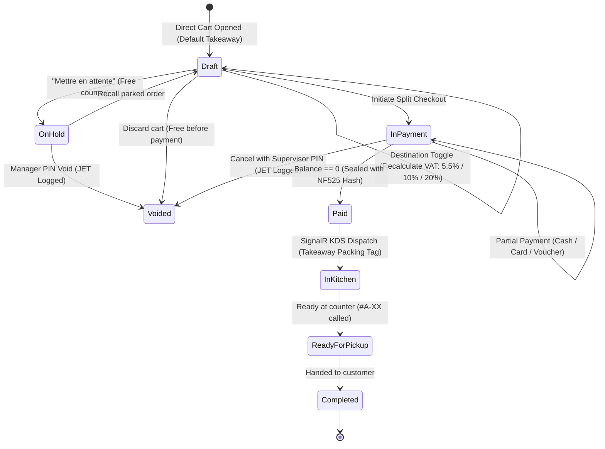

# Data Model: Direct Sales & Takeaway Checkout with Complex Scenarios

**Feature**: `018-takeaway-direct-sales`  
**Date**: 2026-09-13  
**Status**: Complete  

---

## 1. Domain Entities & Value Objects

### OrderDestination (Enum)
Defines where and how the ordered items will be consumed.

```csharp
public enum OrderDestination
{
    Takeaway = 0,    // Default for counter sale (TVA 5.5% scellé / 10% préparé / 20% alcool)
    EatIn = 1,       // Sur Place (TVA 10% nourriture & boissons / 20% alcool)
    Delivery = 2     // Livraison à domicile
}
```

---

### DirectOrder
Represents an active or completed counter sale or takeaway order.

| Field | Type | Constraints | Description |
| :--- | :--- | :--- | :--- |
| `Id` | `Guid` (UUIDv7) | Primary Key | Unique chronological order identifier |
| `TerminalId` | `string` | Max 16 chars | Originating register ID (e.g. "POS-A") |
| `OrderType` | `OrderType` | Enum | `DirectCounterSale` or `Takeaway` |
| `Destination` | `OrderDestination` | Default `Takeaway` | Current consumption destination |
| `PickupNumber` | `string` | Format `#A-01` | Daily terminal-prefixed pickup sequence |
| `PickupBuzzer` | `string?` | Max 16 chars, Optional | Physical pager/buzzer ID given to customer |
| `PickupScheduledAtUtc`| `DateTimeOffset?`| UTC, Optional | Promised pickup timestamp for scheduled orders |
| `Status` | `OrderStatus` | Enum | `Draft`, `OnHold`, `Paid`, `InKitchen`, `Ready`, `Completed`, `Voided` |
| `Lines` | `List<OrderLine>`| Min 1 for checkout | Items, modifiers, and quantities |
| `TaxBreakdown` | `List<OrderTaxLine>` | Recomputed dynamically | Subtotals per VAT rate (5.5%, 10.0%, 20.0%) |
| `Payments` | `List<OrderPaymentLine>` | Sum == TotalTTC | Multi-tender payment entries |
| `TotalHt` | `Money` | Integer cents | Total exclusive of tax |
| `TotalVat` | `Money` | Integer cents | Total VAT amount |
| `TotalTtc` | `Money` | Integer cents | Total inclusive of tax |
| `TipAmount` | `Money` | Integer cents | Counter tip included in payment |
| `CreatedAtUtc` | `DateTimeOffset` | UTC | Order creation timestamp |
| `CompletedAtUtc` | `DateTimeOffset?` | UTC | Checkout completion timestamp |

---

### HeldOrder (Parked Counter Order)
Represents a cart parked on hold at the register to free the counter for other customers.

| Field | Type | Constraints | Description |
| :--- | :--- | :--- | :--- |
| `HoldId` | `Guid` (UUIDv7) | Primary Key | Unique parked cart identifier |
| `TerminalId` | `string` | Required | Register on which the cart was parked |
| `HeldAtUtc` | `DateTimeOffset` | UTC | Timestamp when parked |
| `HeldByStaffId` | `Guid` | Foreign Key | Operator who parked the order |
| `CustomerLabel` | `string?` | Max 64 chars | Optional customer name or reference note |
| `ItemCount` | `int` | $\ge 1$ | Number of items in the parked cart |
| `TotalTtcAmount` | `Money` | Integer cents | Snapshot total TTC when parked |
| `Destination` | `OrderDestination` | Enum | `Takeaway` or `EatIn` |
| `OrderSnapshotJson` | `string` | JSON Payload | Complete serialized cart state for exact restoration |

---

### MealVoucherOverpaymentPolicy (Enum) & CustomerCreditVoucher
Governs the fiscal and financial handling of paper meal vouchers when facial value exceeds the balance due.

```csharp
public enum MealVoucherOverpaymentPolicy
{
    CapAtBalance = 0,        // Policy A (Default): 0€ change given, voucher consumed, surplus forfeited
    StrictRejection = 1,     // Policy B: Rejects any voucher entry strictly greater than balance due
    CustomerCreditVoucher = 2// Policy C: Generates a non-fiscalized store credit voucher for the excess
}
```

#### CustomerCreditVoucher
Issued when Policy C is active and an overpayment occurs:

| Field | Type | Constraints | Description |
| :--- | :--- | :--- | :--- |
| `Id` | `Guid` (UUIDv7) | Primary Key | Credit voucher identifier |
| `VoucherCode` | `string` | Format `CR-XXXX-XXXX` | Barcode/alphanumeric redemption code |
| `OriginalOrderId` | `Guid` | Foreign Key | Originating order ID |
| `TerminalId` | `string` | Originating terminal | Terminal where issued |
| `AmountCents` | `long` | $> 0$ integer cents | Credit value available |
| `IssuedAtUtc` | `DateTimeOffset` | UTC | Issue timestamp |
| `ExpiresAtUtc` | `DateTimeOffset` | UTC | Validity expiration (default: +90 days) |
| `IsRedeemed` | `bool` | Default `false` | True once used against a future order |

---

### TerminalDirectSalesConfig
Configuration persisted per terminal for direct sales and takeaway behavior.

| Parameter | Type | Default | Description |
| :--- | :--- | :--- | :--- |
| `TerminalPrefix` | `string` | `"A"` | Prefix for pickup numbering (`#A-01`) |
| `DefaultDestination` | `OrderDestination` | `Takeaway` | Initial mode when cart opens |
| `MealVoucherPolicy` | `MealVoucherOverpaymentPolicy` | `CapAtBalance` | Policy A, B, or C |
| `MealVoucherDailyCapCents` | `long` | `2500` (25.00 €) | Regulatory max amount per transaction |
| `PromptReceiptOnTakeaway`| `bool` | `true` | Show AGEC prompt ("Demander facturette ?") |
| `MaxConcurrentHeldOrders`| `int` | `10` | Safety limit of parked carts per register |

---

## 2. Entity Relationships & State Lifecycle


