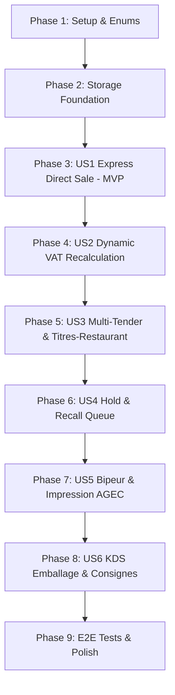

# Tasks: Direct Sales and Takeaway Checkout with Complex Scenarios

**Input**: Design documents from `/specs/018-takeaway-direct-sales/`  
**Prerequisites**: [plan.md](plan.md), [spec.md](spec.md), [research.md](research.md), [data-model.md](data-model.md), [contracts/direct-takeaway-api.yaml](contracts/direct-takeaway-api.yaml)  

## Format: `- [ ] [TaskID] [P?] [Story?] Description with file path`

- **[P]**: Can run in parallel (different files, no dependencies)
- **[Story]**: User story identifier (US1, US2, US3, US4, US5, US6)
- File paths are relative to repository root

---

## Phase 1: Setup (Domain Models & Enums)

**Purpose**: Core domain types and enumerations shared across all takeaway and counter sale stories.

- [x] T001 [P] Create `OrderDestination` enum in `src/RestaurantPos.Domain/Enums/OrderDestination.cs`
- [x] T002 [P] Create `MealVoucherOverpaymentPolicy` enum in `src/RestaurantPos.Domain/Enums/MealVoucherOverpaymentPolicy.cs`
- [x] T003 [P] Create `CustomerCreditVoucher` entity in `src/RestaurantPos.Domain/Entities/CustomerCreditVoucher.cs`
- [x] T004 Create `HeldOrder` entity in `src/RestaurantPos.Domain/Entities/HeldOrder.cs`
- [x] T005 Update `Order` entity with direct counter and takeaway fields (`Destination`, `PickupNumber`, `PickupBuzzer`, `PickupScheduledAtUtc`) in `src/RestaurantPos.Domain/Entities/Order.cs`

---

## Phase 2: Foundational (Storage & Service Interfaces)

**Purpose**: Core services and database persistence required by all user stories.

- [x] T006 Add EF Core database entity configurations and migrations for `HeldOrder` and `CustomerCreditVoucher` in `src/RestaurantPos.Infrastructure/Data/PosDbContext.cs`
- [x] T007 [P] Create `IHeldOrderStorageService` interface in `src/RestaurantPos.Application/Common/Interfaces/IHeldOrderStorageService.cs`
- [x] T008 [P] Implement `HeldOrderStorageService` with local SQLite storage in `src/RestaurantPos.Infrastructure/Services/HeldOrderStorageService.cs`
- [x] T009 [P] Create `ITakeawayCounterService` interface for sequential numbering in `src/RestaurantPos.Application/Common/Interfaces/ITakeawayCounterService.cs`
- [x] T010 Implement `TakeawayCounterService` managing atomic `#A-01`..`#A-99` daily sequences in `src/RestaurantPos.Infrastructure/Services/TakeawayCounterService.cs`

---

## Phase 3: User Story 1 - Vente Directe Express au Comptoir (Priority: P1) 🎯 MVP

**Goal**: Deliver instant default counter sale mode with sub-50ms responsiveness, zero table selection requirement, and 1-touch cash/card closure.

**Independent Test**: Access POS screen $\to$ verify active direct cart open by default in takeaway mode $\to$ add 1 item $\to$ tap `[Billet 20 €]` $\to$ verify NF525 seal, cash change displayed, and automatic return to fresh cart in < 3 taps.

- [x] T011 [P] [US1] Unit test for default direct counter cart initialization in `tests/RestaurantPos.Api.Tests/CounterDirectSaleTests.cs`
- [x] T012 [P] [US1] Create `CreateDirectCounterOrderCommand` and handler in `src/RestaurantPos.Application/Orders/Commands/CreateDirectCounterOrderCommand.cs`
- [x] T013 [US1] Implement `POST /api/orders/counter/direct` endpoint in `src/RestaurantPos.Api/Endpoints/CounterSaleEndpoints.cs`
- [x] T014 [US1] Update tactile POS frontend `src/RestaurantPos.Api/wwwroot/app.js` to open directly in counter sale mode on login without prompting floorplan
- [x] T015 [US1] Add quick cash tender buttons (`Billet 10 €`, `20 €`, `50 €`) and change overlay in `src/RestaurantPos.Api/wwwroot/index.html`

---

## Phase 4: User Story 2 - Recalculation Automatique de TVA Différenciée (Priority: P1)

**Goal**: Recalculate VAT dynamically between EatIn (10% standard) and Takeaway (5.5% sealed foods/drinks, 10% prepared, 20% alcohol) upon destination toggle.

**Independent Test**: Compose cart with 1 sealed canned drink and 1 hot dish $\to$ toggle between `[Sur Place]` and `[À Emporter]` $\to$ verify sub-50ms recalculation of tax breakdown and exact 0-cent invariant.

- [x] T016 [P] [US2] Unit test for dynamic VAT recalculation with 0-cent rounding in `tests/RestaurantPos.Api.Tests/TakeawayTaxCalculationTests.cs`
- [x] T017 [US2] Implement `SwitchOrderDestinationCommand` and MediatR handler in `src/RestaurantPos.Application/Orders/Commands/SwitchOrderDestinationCommand.cs`
- [x] T018 [US2] Implement `POST /api/orders/{orderId}/destination` endpoint in `src/RestaurantPos.Api/Endpoints/CounterSaleEndpoints.cs`
- [x] T019 [US2] Add permanent tactile header toggle `[Sur Place / À Emporter]` in `src/RestaurantPos.Api/wwwroot/index.html`
- [x] T020 [US2] Update client cart rendering in `src/RestaurantPos.Api/wwwroot/app.js` to refresh tax lines immediately on toggle change

---

## Phase 5: User Story 3 - Multi-Règlement Complexe et Titres-Restaurant Plafonnés (Priority: P2)

**Goal**: Support split payments combining meal vouchers (capped at 25.00 € on eligible food), cash, card, and counter tips with configurable overpayment policies.

**Independent Test**: Pay a 30.00 € note using a 25.00 € meal voucher on eligible items $\to$ verify 0.00 € change given under Policy A $\to$ pay remaining 5.00 € with card + 1.00 € tip $\to$ verify fiscal totals and tip ledger segregation.

- [x] T021 [P] [US3] Unit tests for meal voucher eligibility, 25.00 € ceiling, and Policy A/B/C in `tests/RestaurantPos.Api.Tests/MealVoucherPolicyTests.cs`
- [x] T022 [US3] Implement `CounterCheckoutCommand` with multi-tender split logic in `src/RestaurantPos.Application/Orders/Commands/CounterCheckoutCommand.cs`
- [x] T023 [US3] Implement meal voucher policy engine (CapAtBalance, StrictRejection, CustomerCredit) in `src/RestaurantPos.Infrastructure/Services/MealVoucherPolicyService.cs`
- [x] T024 [US3] Implement `POST /api/orders/counter/checkout` endpoint in `src/RestaurantPos.Api/Endpoints/CounterSaleEndpoints.cs`
- [x] T025 [US3] Update payment modal in `src/RestaurantPos.Api/wwwroot/app.js` with meal voucher selector, eligibility checker, tip field, and split balance tracker

---

## Phase 6: User Story 4 - File d'Attente Comptoir : Mise en Attente (Hold) et Rappel (Recall) (Priority: P2)

**Goal**: Enable one-touch parking of active carts to free checkout lines, with tactile recall drawer and supervisor PIN protection on cart voiding.

**Independent Test**: Park an active cart with `[Mettre en attente]` $\to$ verify badge `En attente (1)` and fresh blank cart $\to$ recall parked cart $\to$ verify complete item/modifier restoration $\to$ test manager PIN requirement on voiding parked cart.

- [x] T026 [P] [US4] Integration tests for hold, recall, and supervisor PIN void in `tests/RestaurantPos.Api.Tests/HeldOrderQueueTests.cs`
- [x] T027 [US4] Implement `HoldCounterOrderCommand`, `RecallCounterOrderCommand`, and `VoidHeldOrderCommand` in `src/RestaurantPos.Application/Orders/Commands/HeldOrderCommands.cs`
- [x] T028 [US4] Implement `POST /api/orders/counter/hold`, `GET /api/orders/counter/held`, and `POST /api/orders/counter/held/{id}/recall` in `src/RestaurantPos.Api/Endpoints/CounterSaleEndpoints.cs`
- [x] T029 [US4] Add tactile badge `[En attente (N)]` and slide-over recall drawer in `src/RestaurantPos.Api/wwwroot/index.html`
- [x] T030 [US4] Implement hold and recall client workflows with supervisor PIN modal in `src/RestaurantPos.Api/wwwroot/app.js`

---

## Phase 7: User Story 5 - Identification Client, Bipeur & Impression Anti-Gaspillage (Priority: P3)

**Goal**: Assign sequential `#A-01` pickup numbers, buzzer/pager references, and prompt for fiscal receipt printing (Loi AGEC) while systematically printing the pickup coupon.

**Independent Test**: Complete a takeaway sale $\to$ verify `#A-01` assigned $\to$ verify tactile prompt *"Demander facturette ?"* $\to$ test compact coupon printing vs combined fiscal receipt.

- [x] T031 [P] [US5] Unit test for `#A-01` monotonic sequence generation and reset in `tests/RestaurantPos.Api.Tests/PickupNumberingTests.cs`
- [x] T032 [US5] Implement `TakeawayTicketFormatter` for compact pickup voucher and AGEC combined receipt in `src/RestaurantPos.Infrastructure/Printing/TakeawayTicketFormatter.cs`
- [x] T033 [US5] Add optional buzzer/pager input field to checkout modal in `src/RestaurantPos.Api/wwwroot/index.html`
- [x] T034 [US5] Add AGEC anti-waste receipt prompt with 3-second auto-dismiss in `src/RestaurantPos.Api/wwwroot/app.js`

---

## Phase 8: User Story 6 - Routage KDS Emballage & Consignes Écologiques (Priority: P3)

**Goal**: Transmit takeaway orders with packing tags and reusable container deposit lines to kitchen KDS packing station.

**Independent Test**: Complete a takeaway order with container deposit $\to$ verify SignalR broadcast to `TakeawayPackingStation` with packaging checklist and deposit line (+2.00 €).

- [x] T035 [P] [US6] Unit test for packaging checklist and deposit calculation in `tests/RestaurantPos.Api.Tests/TakeawayPackagingTests.cs`
- [x] T036 [US6] Enhance `KdsHub` and order dispatching to broadcast `[À EMPORTER]` packing events in `src/RestaurantPos.Api/Hubs/KdsHub.cs`
- [x] T037 [US6] Add packaging checklist badge and deposit refund action in `src/RestaurantPos.Api/wwwroot/app.js`

---

## Phase 9: Polish & Cross-Cutting Integration

**Purpose**: End-to-end automated testing, NF525 fiscal audit verification, and performance validation.

- [x] T038 Create comprehensive Playwright E2E test suite in `tests/RestaurantPos.Web.E2ETests/tests/takeaway-direct-sales.spec.ts`
- [x] T039 Verify daily Z-closure validation for unclosed held orders in `src/RestaurantPos.Infrastructure/Services/FiscalClosureService.cs`
- [x] T040 Execute complete test suite (`dotnet test` + Playwright) and validate zero compiler warnings with `TreatWarningsAsErrors=true`

---

## Dependencies & Execution Order

---

## Implementation Strategy

### MVP Scope (Phases 1, 2, and 3)
1. Complete Setup & Enums (T001 - T005).
2. Complete Storage Foundation (T006 - T010).
3. Complete User Story 1 (T011 - T015).
4. **Validation Checkpoint**: Test direct counter sale (< 3 taps, default takeaway mode, cash change overlay).

### Incremental Feature Slices
- **Slice 2**: Dynamic VAT Recalculation (T016 - T020).
- **Slice 3**: Complex Multi-Tender & Titres-Restaurant (T021 - T025).
- **Slice 4**: Hold & Recall Queue with Manager PIN Gate (T026 - T030).
- **Slice 5**: Takeaway Numbers, Buzzer & AGEC Prompt (T031 - T034).
- **Slice 6**: KDS Packing Station & Reusable Containers (T035 - T037).
- **Slice 7**: End-to-End Playwright Automation & Fiscal Sealing (T038 - T040).
